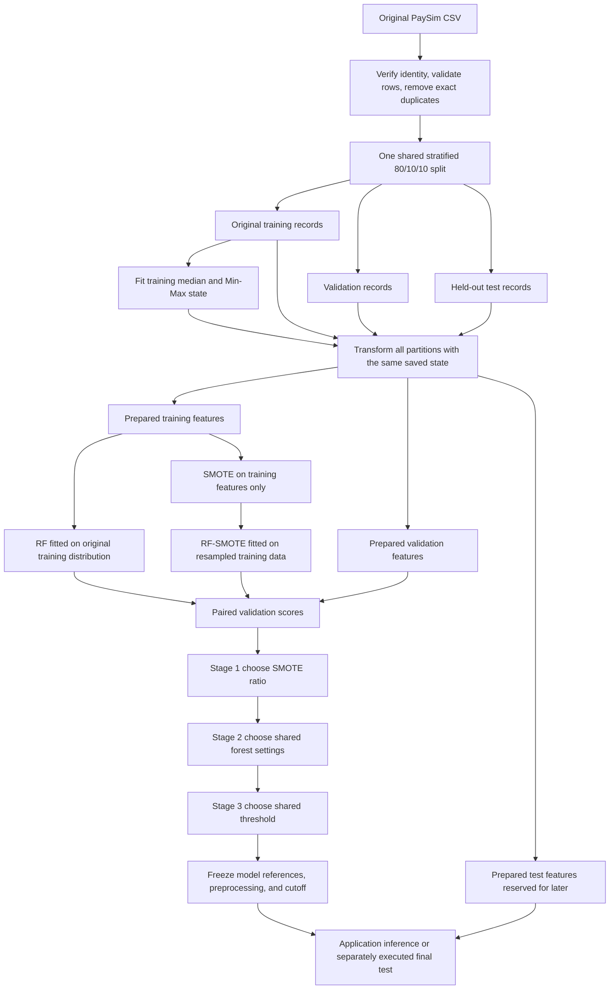

# Preprocessing, Splitting, Training, and Hyperparameter Validation

This guide explains how Integritree turns the original PaySim CSV into two saved
fraud classifiers: Random Forest (RF) and Random Forest trained with SMOTE
(RF-SMOTE). It connects the methodology to the Python implementation, important
functions, configuration files, and saved experiment evidence.

Reviewed against the local implementation and recorded artifacts on **October 7,
2026**. The examples of completed research refer to preparation run
`paysim_phase2_20260918` and selection run
`paysim_three_stage_20260928_172539`. This guide does not execute a new experiment.

The main distinction to remember is that **training learns the trees, validation
chooses settings, and held-out testing evaluates the frozen result**. Here,
“hyperparameter maxing” means **hyperparameter tuning or selection**: maximizing
a declared validation objective, rather than setting every parameter to its
largest possible value.

## Contents

1. [The complete process](#1-the-complete-process)
2. [Where the implementation lives](#2-where-the-implementation-lives)
3. [Configuration and experiment identity](#3-configuration-and-experiment-identity)
4. [Reading, validating, and cleaning the source](#4-reading-validating-and-cleaning-the-source)
5. [Creating the shared partitions](#5-creating-the-shared-partitions)
6. [Engineering and scaling the predictors](#6-engineering-and-scaling-the-predictors)
7. [Understanding the prepared files](#7-understanding-the-prepared-files)
8. [Training RF and RF-SMOTE](#8-training-rf-and-rf-smote)
9. [Scoring and evaluating a candidate](#9-scoring-and-evaluating-a-candidate)
10. [The three validation stages](#10-the-three-validation-stages)
11. [How the selector coordinates files and functions](#11-how-the-selector-coordinates-files-and-functions)
12. [Loading the frozen result](#12-loading-the-frozen-result)
13. [Recorded results and their limits](#13-recorded-results-and-their-limits)
14. [Commands and software checks](#14-commands-and-software-checks)
15. [Common questions and debugging](#15-common-questions-and-debugging)

## 1. The complete process

The actual order matters. Source validation and exact deduplication happen before
splitting. Learning the amount median and scaling parameters happens **after**
splitting, using only the original training records. SMOTE happens after the
training features have been transformed.



Stages 1 and 2 repeat the fitting/evaluation part for candidate settings. Stage 3
uses the winning pair's saved validation scores; it does not train more trees.
The diagram's application-inference branch receives new inputs, whereas the
final-test branch receives the reserved test features.

Both models use the same original split, feature definitions, fitted
preprocessor, forest settings within a candidate, and classification threshold.
The experimental difference is that RF-SMOTE receives additional synthetic
fraud training rows.

## 2. Where the implementation lives

The core modules are under `backend/src/integritree/`. Paths in this table link
directly to the source files.

| File | Responsibility | Important functions or classes |
| --- | --- | --- |
| [settings.py](../backend/src/integritree/settings.py) | Resolves local data, artifact, report, and application paths. | `Settings`, `load_settings()` |
| [config.py](../backend/src/integritree/config.py) | Parses experiment YAML and checks that required settings are resolved. | `load_experiment()`, `ExperimentConfig.require_ready()` |
| [ml/data.py](../backend/src/integritree/ml/data.py) | Audits the raw source, deduplicates it, streams Parquet, and assigns split membership. | `validate_raw()`, `audit_source()`, `stratified_membership()`, `ParquetSink` |
| [ml/features.py](../backend/src/integritree/ml/features.py) | Defines the five allowed source predictors and eleven engineered features. | `validate_predictors()`, `engineer_features()`, `FEATURE_COLUMNS` |
| [ml/preprocessing.py](../backend/src/integritree/ml/preprocessing.py) | Fits, saves, and reapplies training-only imputation/scaling state. | `PreprocessingState`, `FittedPreprocessor` |
| [ml/preparation.py](../backend/src/integritree/ml/preparation.py) | Coordinates source audit, splitting, fitting preprocessing, and writing prepared files. | `prepare_dataset()`, `selected_batches()`, `load_prepared_split()` |
| [ml/training.py](../backend/src/integritree/ml/training.py) | Fits the paired forests, applies SMOTE, and verifies saved models. | `train_models()`, `forest_parameters()`, `resample_training()`, `_reusable_rf()` |
| [ml/inference.py](../backend/src/integritree/ml/inference.py) | Produces aligned model probabilities and predicted labels. | `feature_matrix()`, `fraud_scores()`, `classify()`, `predict_features()`, `predict_records()` |
| [ml/evaluation.py](../backend/src/integritree/ml/evaluation.py) | Computes confusion counts, metrics, paired comparisons, and McNemar results. | `metrics()`, `evaluate_pair()`, `mcnemar()` |
| [ml/research.py](../backend/src/integritree/ml/research.py) | Coordinates evaluation and saves/verifies reports. | `evaluate_run()`, `paired_scores()`, `verify_prepared()`, `load_report()` |
| [ml/staged_selection.py](../backend/src/integritree/ml/staged_selection.py) | Runs the sequential search, freezes decisions, handles reuse/resume, and loads selected bundles. | `SelectionProtocol`, `select_three_stage()`, `choose_ratio()`, `choose_forest()`, `load_staged_selected()` |
| [ml/threshold_search.py](../backend/src/integritree/ml/threshold_search.py) | Evaluates the common threshold grid efficiently. | `percent_grid_thresholds()` |
| [ml/selection_utils.py](../backend/src/integritree/ml/selection_utils.py) | Independently checks exact mean F1 and releases unused memory. | `exact_mean_f1()`, `release_candidate_memory()` |
| [ml/artifacts.py](../backend/src/integritree/ml/artifacts.py) | Validates model bundles and returns models with their preprocessing/configuration. | `ModelBundle`, `load_bundle()` |

The scripts in [backend/scripts](../backend/scripts) are command entry points.
The substantive algorithms live in the modules above. For example,
`scripts/select_three_stage.py` invokes the selector; it is not a second,
independent implementation of hyperparameter search.

## 3. Configuration and experiment identity

### Three different kinds of settings

[experiment.yaml](../backend/configs/experiment.yaml) supplies the dataset
identity, split, seeds, preprocessing policy, baseline forest settings, SMOTE
settings, scoring policy, evaluation policy, and SHAP settings.

[validation_three_stage.yaml](../backend/configs/validation_three_stage.yaml)
supplies the search space and selection rules. It determines which ratios,
forest configurations, and thresholds the selector will compare.

`settings.py` determines where files are stored and which saved bundle the
application loads. Environment variables and the backend `.env` may override
these paths. A local application path setting is not a model hyperparameter.

`load_experiment()` rejects invalid YAML, including duplicate keys. The parsed
`ExperimentConfig` uses typed fields and constraints. `require_ready(stage)`
checks the requested stage and its prerequisites: for example, evaluation
requires resolved preparation, training, and evaluation settings.

The schema can describe more choices than the implemented experiment permits.
`validate_preparation_config()` specifically requires Min-Max scaling,
`median_unknown`, exact duplicate removal, and the approved feature order.
`validate_training_config()` specifically requires ordinary encoded SMOTE,
mean-tree probability, the baseline 0.50 threshold, and the fixed-baseline
training procedure. Schema acceptance alone does not authorize an arbitrary
alternative method in this pipeline.

### Baseline defaults versus selected settings

| Setting | Standalone training defaults | Recorded validation-selected result |
| --- | --- | --- |
| Trees | 100 | 100 |
| Maximum depth | 20 | 10 |
| Minimum samples per leaf | 1 | 1 |
| SMOTE fraud:legitimate ratio | 1:1 (`1.0`) | 1:100 (`0.01`) |
| Shared fraud cutoff | `0.50` | `0.43` |

Reading only `experiment.yaml` would therefore give the wrong impression of the
deployed research settings. During selection, `candidate_config()` copies the
base configuration and replaces the candidate ratio and forest settings. After
selection, the bundle loader applies the saved selected threshold to the
effective configuration without rewriting the original fitted candidate.

All three configured seeds are `42`: one each for splitting, forest randomness,
and SMOTE. Fixed seeds make repeated runs under matching conditions reproducible;
they do not measure variation across different seeds.

## 4. Reading, validating, and cleaning the source

### Original columns and model inputs are different

`RAW_COLUMNS` contains these eleven PaySim columns in the expected source order:

```text
step, type, amount, nameOrig, oldbalanceOrg, newbalanceOrig,
nameDest, oldbalanceDest, newbalanceDest, isFraud, isFlaggedFraud
```

Only five source columns enter feature engineering:

```python
SOURCE_COLUMNS = ["step", "type", "amount", "nameOrig", "nameDest"]
```

`isFraud` is the target, `y`, used for stratification, supervised fitting, and
evaluation. It is never part of the predictor matrix, `X`. Balances and
`isFlaggedFraud` are retained in the source audit but excluded from model inputs.
Full account identifiers are reduced to merchant indicators; their complete
strings are not learned as model features.

### What `validate_raw()` and `validate_predictors()` check

The raw validator enforces the expected header/order and checks the original
fields. It calls `validate_predictors()` for the five predictors, then validates
balance and label/flag fields separately.

| Input | Implemented behavior |
| --- | --- |
| `step` | Must be present, finite, an integer, at least 1, and no larger than `2**53 - 1`. |
| `amount` | Missing is allowed for later training-median imputation; malformed, negative, or nonfinite values are rejected. Zero is valid. |
| `type` | Supported categories are Cash In, Cash Out, Debit, Payment, and Transfer in their uppercase source codes. Missing values become `unknown`; unrecognized raw nonempty categories are rejected. |
| `nameOrig`, `nameDest` | Required strings beginning with `C` or `M`, followed by at least one character. |
| `isFraud` | Required binary value, 0 or 1. Never imputed. |
| Balances | Nonmissing entries must be finite and nonnegative; these fields are not predictors. |
| `isFlaggedFraud` | Nonmissing entries must be binary; this field is not a predictor. |

The predictor-level validator accepts the internal `unknown` category, while
the raw PaySim boundary reserves it for missing source categories rather than
silently accepting arbitrary source text. Errors report counts and example row
positions through `DataValidationError`, rather than logging transaction values.

### Source identity and exact duplicates

`audit_source()` checks the CSV's SHA-256 fingerprint against the configured
dataset identity, verifies the header, and streams it with PyArrow. It checks
the final row count and hashes the source again to detect changes during the
audit.

For deduplication, the function converts each validated row into a canonical key
covering **all eleven typed original columns**. A temporary SQLite table records
the first occurrence. Later matches are removed, and their original row numbers
are linked to the first occurrence in `duplicates.parquet`.

This is not deduplication by amount, account, or the eleven engineered features.
Two transactions can have identical model features and still remain separate
source records. Comparing typed source values also means formatting differences
such as equivalent numeric representations do not define separate records.

Deduplication precedes random splitting so exact duplicate source rows cannot
be distributed across partitions. This does not make the split account-disjoint
or remove every possible dependency between transactions.

The recorded [audit](../backend/data/prepared/paysim_phase2_20260918/audit.json)
contains 6,362,620 retained rows, zero removed exact duplicates, zero missing
values across the original columns, and 16 zero-amount transactions. The code's
missing-value and duplicate policies are supported behaviors; they should not
be described as changes that actually affected this particular dataset.

## 5. Creating the shared partitions

### What stratification means here

`stratified_membership(labels, seed)` creates one shared assignment of retained
rows to training, validation, and test. Stratification approximately preserves
the original legitimate/fraud proportions in each partition; it does not
balance the classes.

The important code is:

```python
train, held = train_test_split(
    positions, test_size=0.2, random_state=seed, stratify=labels
)
validation, test = train_test_split(
    held, test_size=0.5, random_state=seed, stratify=labels[held]
)
```

The first call reserves 20% of all records. The second call divides that reserved
20% equally, so each resulting held-out partition is 10% of the full dataset.
The function returns a `uint8` array with `0 = train`, `1 = validation`, and
`2 = test`. Both calls use the same configured seed.

Both labels must exist in the source and in every partition. If the dataset is
too small to satisfy those requirements, preparation fails instead of silently
producing an unusable split.

### Actual recorded partition sizes

These counts come from the completed
[preparation metadata](../backend/data/prepared/paysim_phase2_20260918/metadata.json).

| Partition | All rows | Legitimate | Fraud | Purpose |
| --- | ---: | ---: | ---: | --- |
| Training | 5,090,096 | 5,083,526 | 6,570 | Fit preprocessing, generate SMOTE samples, and learn trees. |
| Validation | 636,262 | 635,440 | 822 | Compare candidate settings and choose the common cutoff. |
| Test | 636,262 | 635,441 | 821 | Reserved for evaluation after selection is frozen. |
| Total | 6,362,620 | 6,354,407 | 8,213 | Original retained population. |

This is a random stratified split by row. It is neither a chronological split
nor a group split by account. Those are different experimental designs and must
not be claimed for this implementation.

### Preventing preprocessing leakage

After membership is assigned, `selected_batches(..., split=0)` yields training
predictors only. `prepare_dataset()` uses those records to calculate the amount
median and fit scaling. The validation and test partitions receive the resulting
transform; they do not change it.

The code writes transformed test features during preparation. That operation
is different from using test labels or scores to select a model. Preparing
reserved features with an already training-fitted transform does not itself
perform final test evaluation.

## 6. Engineering and scaling the predictors

### The eleven features and their meanings

`engineer_features(frame, amount_median)` validates the five source predictors,
fills missing amounts with the supplied training median, and constructs:

| Feature | Formula or rule | Interpretation |
| --- | --- | --- |
| `hour_of_day` | `(step - 1) % 24` | Simulated hour from 0 through 23. |
| `day_of_week` | `((step - 1) // 24) % 7` | Simulated day index from 0 through 6. |
| `type_CASH_IN` | 1 when type is `CASH_IN`; otherwise 0. | Cash In indicator. |
| `type_CASH_OUT` | 1 when type is `CASH_OUT`; otherwise 0. | Cash Out indicator. |
| `type_DEBIT` | 1 when type is `DEBIT`; otherwise 0. | Debit indicator. |
| `type_PAYMENT` | 1 when type is `PAYMENT`; otherwise 0. | Payment indicator. |
| `type_TRANSFER` | 1 when type is `TRANSFER`; otherwise 0. | Transfer indicator. |
| `log_amount` | `np.log1p(amount)` | Natural logarithm of `1 + amount`. |
| `is_zero_amount` | 1 when the amount after imputation is zero. | Zero-amount indicator. |
| `is_merchant_origin` | 1 when `nameOrig` starts with `M`. | Sender merchant indicator. |
| `is_merchant_dest` | 1 when `nameDest` starts with `M`. | Recipient merchant indicator. |

The simulated day index is not evidence of an actual calendar weekday. Any UI
weekday name for PaySim is a display convention. Receipt time mapping is a
separate adapter described in [RECEIPT_MAPPING.md](RECEIPT_MAPPING.md).

An unknown transaction type produces five zeros, rather than being assigned to
a known category. `log1p` handles zero naturally and compresses the numerical
range of large amounts. The separate zero flag preserves an explicit distinction
between zero and nonzero amounts.

The feature order above is a contract. The saved trees consume columns by
position. Supplying the right eleven names in the wrong order would change
their meaning, so the code rejects reordered matrices.

### A worked feature example

Consider this illustrative input:

```text
step = 26
type = TRANSFER
amount = 100
nameOrig = C123
nameDest = M456
```

Subtracting one from `step` gives 25. The unscaled vector, in model order, is:

```text
[1, 1, 0, 0, 0, 0, 1, log(101), 0, 0, 1]
```

Hour is 1, simulated day index is 1, only the Transfer indicator is active, the
amount is not zero, and only the recipient is marked as a merchant. This is
feature construction, not a claim about whether this illustrative transaction
is fraudulent.

### Learning the amount median

For large preparation runs, `prepare_dataset()` writes the training amounts to
a temporary NumPy memory-mapped array. `np.nanmedian()` finds the median while
ignoring missing values. If all training amounts are missing, fitting fails.

The completed run saved a median of **74,841.03** in
[preprocessing.json](../backend/data/prepared/paysim_phase2_20260918/preprocessing.json).
The same number is used for any later missing amount, including validation or
inference input. It is not recomputed for an uploaded batch.

### Fitting Min-Max scaling

Only `log_amount`, `hour_of_day`, and `day_of_week` are scaled. The eight binary
indicators remain 0/1 in original transformed records.

`FittedPreprocessor.fit_batches()` calls `MinMaxScaler(clip=False).partial_fit()`
on engineered **training** batches. This learns extrema without requiring all
training feature rows in one DataFrame. The word `partial_fit` here refers to
the scaler, not incremental Random Forest training.

For a nonconstant feature, the usual Min-Max expression is:

```text
scaled_value = (value - training_minimum) / (training_maximum - training_minimum)
```

The saved state stores the fitted multiplier and offset. Transformation uses
the library's multiply-then-add order:

```python
scaled *= np.array(self.state.scale)
scaled += np.array(self.state.offset)
```

Persisting these fitted coefficients also handles constant training columns
without a manually introduced divide-by-zero formula. `clip=False` means a new
value outside the training range may transform below 0 or above 1. The code
neither clips it nor refits the scaler to accommodate it.

For the recorded state, hour ranges from 0 to 23 and day from 0 to 6. The worked
example therefore becomes approximately `1/23` for hour, `1/6` for day, and
`log(101) * 0.054519295105796506` for log amount, about `0.251613`.

Scaling is relevant to SMOTE because neighbor selection uses the feature
representation's distances. The code applies the same representation to RF so
the paired comparison shares preprocessing. Scaling does not make ordinary
SMOTE understand the categories as categories, and it does not make time
features cyclical.

### The preprocessor's important methods

| Method | Input and output | When it is used |
| --- | --- | --- |
| `fit(training_inputs)` | Training predictors to a fitted preprocessor. | Convenient in-memory fitting, including tests. |
| `fit_batches(amount_median, training_batches)` | Training median and batches to fitted state. | Full preparation workflow. Caller must supply training-only data. |
| `transform(inputs)` | Five source predictors to eleven scaled model features. | Preparation and ordinary research inference. |
| `transform_engineered(features)` | Eleven unscaled, ordered features to scaled features. | Internal callers such as the confirmed-receipt adapter; not a public raw-input validator. |
| `save(path)` / `load(path)` | Fitted state to/from JSON. | Carry identical preprocessing into training and later prediction. |

## 7. Understanding the prepared files

`prepare_dataset()` writes a distinct directory under `backend/data/prepared/`.
It refuses to overwrite an existing run directory.

```text
data/prepared/<preparation-run>/
  metadata.json
  configuration.json
  audit.json
  source.parquet
  duplicates.parquet
  preprocessing.json
  split_manifest.parquet
  train_features.parquet
  validation_features.parquet
  test_features.parquet
```

| File | What it preserves | Main downstream consumer |
| --- | --- | --- |
| `source.parquet` | Validated retained original rows and one-based source row numbers. | Preparation's training selection and transformation passes. |
| `duplicates.parquet` | Removed source-row IDs and their first occurrences. | Audit/reproducibility review. |
| `split_manifest.parquet` | Source row number, split name, and actual label. | `load_prepared_split()` for aligned labels and identity. |
| `*_features.parquet` | Source row number plus eleven transformed predictors. | Training or evaluation for the requested partition. |
| `preprocessing.json` | Median, feature order, scaled columns, extrema, multiplier, offset, and training row count. | `FittedPreprocessor.load()`. |
| `configuration.json` | Configuration snapshot used for preparation. | Compatibility checks before later stages. |
| `metadata.json` | Completion status, row counts, splits, package versions, implementation hashes, and file hashes. | Preparation/model/report integrity checks. |
| `audit.json` | Source fingerprint, class/type counts, missingness, duplicate counts, ranges, and audit status. | Research reporting and failure diagnosis. |

`load_prepared_split(bundle, split)` checks completion, schema/order, hashes,
source-row alignment, uniqueness, and row count. It returns:

```python
features, labels, source_row_numbers = load_prepared_split(prepared, "train")
```

The target is loaded from the manifest, not inserted into the model features.
Transaction identities later combine the dataset hash with the original row
number. This lets the code prove that scores and labels refer to the same rows.

Preparation is streamed, but `load_prepared_split()` materializes the selected
split in memory. The overall training pipeline is therefore not an entirely
out-of-core learning algorithm.

## 8. Training RF and RF-SMOTE

### What `train_models()` does

The function receives the prepared directory, candidate configuration, output
root, optional run ID, worker count, and optionally a compatible saved RF.
Its important sequence is:

1. Validate the supported training/preprocessing policy.
2. Check preparation completion, hashes, dataset identity, split, and split seed.
3. Estimate working-array memory for the requested SMOTE ratio.
4. Load only the original training split and saved preprocessor.
5. Check feature order, finiteness, label alignment, class counts, and training size.
6. Fit RF on the original transformed training rows, or reuse a verified match.
7. Apply SMOTE to those training rows and fit RF-SMOTE.
8. Save each model, reload it, and verify that its probabilities are unchanged.
9. Write the audit and hashes, mark the bundle complete, and validate it through `load_bundle()`.

The forest-fitting call is:

```python
model = RandomForestClassifier(**parameters).fit(values, labels)
```

`values` contains eleven predictors. `labels` contains the actual training class.
The validator requires fraud to be the minority and at least `k_neighbors + 1`
fraud training examples, because this function prepares a paired RF/SMOTE run.

### How a Random Forest learns

Each tree learns feature tests that divide its training sample into leaves.
The implementation uses Gini impurity, bootstrapped samples, and `sqrt` feature
selection at splits. Trees can learn different partitions because of the
sampling and feature randomness. A leaf supplies a class distribution, and the
forest averages tree probabilities. See the official
[RandomForestClassifier reference](https://scikit-learn.org/stable/modules/generated/sklearn.ensemble.RandomForestClassifier.html).

For a binary node, Gini impurity is `1 - p0**2 - p1**2`, where `p0` and `p1`
are its legitimate and fraud proportions. A pure node has impurity zero. Tree
fitting searches for splits that reduce impurity subject to the configured
constraints. The outer validation search does not manually choose those split
values; it compares forests that have already learned them from training data.

These are learned parameters: feature choices, split values, and leaf class
distributions. Hyperparameters instead constrain how fitting proceeds:

| Setting | Role in this implementation | Search treatment |
| --- | --- | --- |
| `n_estimators` | Number of trees. | Stage 2 compares 100 and 200. |
| `max_depth` | Maximum depth of each tree. | Stage 2 compares 10 and 20. |
| `min_samples_leaf` | Minimum training samples permitted in a leaf. | Stage 2 compares 1, 10, and 50. |
| `min_samples_split` | Minimum samples required to consider splitting a node. | Fixed at 2. |
| `max_features` | Features considered when looking for a split. | Fixed at `sqrt`. |
| `bootstrap` | Sample training rows with replacement for each tree. | Fixed at `True`. |
| `class_weight` | Optional weighting of classes. | Fixed to `None`; there is no extra balanced class weighting. |
| `criterion` | Split-quality measure. | Fixed to `gini`. |
| `random_state` | Reproducible forest randomness. | Fixed model seed 42. |
| `n_jobs` | Parallel tree workers. | Three-stage selection requires 1. |

`forest_parameters()` is the bridge from configuration fields to estimator
arguments. Both models receive the same parameter dictionary. A deeper forest
or more trees is not automatically selected: the declared validation objective
decides which tested configuration is retained.

### What SMOTE changes

`resample_training()` explicitly converts features to `float64` and calls:

```python
sampler = SMOTE(
    sampling_strategy=config.smote.sampling_ratio,
    k_neighbors=config.smote.k_neighbors,
    random_state=config.seeds.smote,
)
resampled, targets = sampler.fit_resample(values, labels)
```

The ratio describes the desired minority/majority count after oversampling.
Thus `0.01` means approximately one fraud training row per hundred legitimate
training rows, not “fraud is exactly 1% of the resampled population.” The SMOTE
configuration uses five neighbors and seed 42. The library's ratio and neighbor
parameter meanings are documented in the official
[SMOTE reference](https://imbalanced-learn.org/stable/references/generated/imblearn.over_sampling.SMOTE.html).

To generate an example, ordinary SMOTE selects a minority training vector,
chooses one of its minority neighbors, and interpolates between them:

```text
x_new = x_original + lambda * (x_neighbor - x_original)
```

Here the vectors are already encoded and scaled, and `lambda` is a random
fraction between 0 and 1. For an illustrative coordinate, values 0.20 and 0.60
with `lambda = 0.25` give `0.30`. The same interpolation fraction applies across
that synthetic vector. This creates a numeric training example, not an
independently observed transaction. The library performs this generation inside
`fit_resample()`; Integritree configures it and audits its output. See the
[SMOTE sample-generation explanation](https://imbalanced-learn.org/stable/over_sampling.html#sample-generation).

The selected run's
[training audit](../backend/artifacts/paysim_three_stage_20260928_172539/candidates/ratio_0.01_trees_100_depth_10_leaf_1/train_20260928T092543_93f9a4e8/training_audit.json)
records:

| Quantity | Count |
| --- | ---: |
| Original legitimate training rows | 5,083,526 |
| Original fraud training rows | 6,570 |
| Fraud rows after SMOTE | 50,835 |
| Added synthetic fraud rows | 44,265 |
| Total RF-SMOTE training rows | 5,134,361 |

Integer row counts produce an achieved ratio of approximately
`0.009999948854397518`, rather than exactly `0.01`. The implementation checks the
library's integer target count, verifies that original rows/labels remain at the
front unchanged, verifies that appended labels are fraud, and rejects nonfinite
synthetic features.

Ordinary SMOTE operates on the encoded numeric feature space; it is not SMOTENC.
Synthetic indicators may therefore be fractional. The implementation preserves
those values: no rounding, truncation, argmax reassignment, or synthetic-row
filtering. It audits fractional indicators and rows with multiple positive type
indicators. The selected run reports zero for those indicator audit counts;
that observation does not establish that fractions are impossible for other
inputs or runs.

SMOTE changes only the RF-SMOTE training branch. The benchmark remains on the
original distribution. Neither validation nor test is oversampled, and synthetic
records do not acquire original transaction identities.

### Saving and verifying a trained pair

An ordinary fitted candidate contains `rf.joblib`, `rf_smote.joblib`, a copied
preprocessor, configuration, preparation metadata, training audit, and reload
verification. A separate `metadata.json` lists file hashes and provenance.

Before SMOTE, training retains up to the first 128 original training feature
rows as a verification sample. After each model is saved and reloaded, its
probabilities must agree within absolute tolerance `1e-12` and zero relative
tolerance. This checks serialization consistency; it is not a validation score.

`memory_preflight()` estimates working-array RAM using the selected ratio. It
can stop an infeasible run before fitting, but its estimate does not guarantee
the peak memory used by trees and runtime overhead. `release_candidate_memory()`
releases unused allocations between candidates; it does not relax the checks.

## 9. Scoring and evaluating a candidate

### Probability versus classification

`fraud_scores()` finds class `1` in `model.classes_` and extracts that column of
`predict_proba()`. It rejects nonfinite or out-of-range scores. The system uses
mean tree probabilities, not the fraction of trees casting a hard fraud vote.

`classify()` applies the common cutoff:

```python
return (np.asarray(scores) >= threshold).astype("uint8")
```

Comparison uses the unrounded score. At a threshold of 0.43, scores of 0.42999,
0.43000, and 0.43001 produce labels 0, 1, and 1. Formatting a score for display
must not change this decision. Risk-display bands are also separate from the
classification cutoff.

### How evaluation files are produced

`evaluate_run()` loads the saved bundle, checks preparation provenance, loads
the requested split, and calls `paired_scores()`. That helper predicts in batches
of 25,000 using both models on the same features and transaction IDs.

The output prediction table includes identity, source row, actual label, split,
run ID, both continuous scores, both predicted labels, and the threshold.
`evaluate_pair()` computes each model's metrics, descriptive differences, and
the paired McNemar analysis. `evaluate_run()` writes these alongside figures and
an effective-configuration record.

Candidate evaluation defaults to `validation`. Evaluating `test` is a separate
operation, and the code requires a bundle marked `validation_selected` for that
operation. The selection procedure itself does not request test features.

### Metrics and their roles

`TP` is correctly detected fraud; `FP` is legitimate activity flagged as fraud;
`FN` is missed fraud; `TN` is correctly classified legitimate activity.

| Metric | Calculation or meaning | Role in selection |
| --- | --- | --- |
| Precision | `TP / (TP + FP)` | Reported; shows how many flagged cases are actually fraud. |
| Recall | `TP / (TP + FN)` | Reported; shows how much labeled fraud is detected. |
| F1 | `2*TP / (2*TP + FP + FN)` | Mean of the two models' F1 scores determines Stage 3. |
| Average Precision | Precision weighted by recall increases across score thresholds. | Determines Stage 1; the two-model mean determines Stage 2. |
| MCC | `(TP*TN - FP*FN) / sqrt((TP+FP)(TP+FN)(TN+FP)(TN+FN))` | Reported summary using all four confusion counts. |
| Accuracy | `(TP + TN) / total` | Reported; not the search objective. |

The metric key `pr_auc` is explicitly labeled **PR-AUC (Average Precision)**.
The implementation calls `average_precision_score(y, scores)`; it does not
calculate trapezoidal area under the precision-recall curve. AP evaluates score
ranking across thresholds and is not determined by the single 0.50 cutoff used
for supplementary candidate classification metrics. See the official
[Average Precision reference](https://scikit-learn.org/stable/modules/generated/sklearn.metrics.average_precision_score.html).

With only 8,213 fraud records among more than 6.3 million rows, accuracy alone
can conceal poor fraud detection. Predicting every record as legitimate would
already produce approximately 99.87% accuracy while detecting no fraud.

Undefined metrics are represented with a null value and a reason, rather than
silently replaced with zero. Threshold CSVs use blank entries where applicable.
For example, precision is undefined when no records are predicted positive.
F1 is computed directly from counts and can still be defined as zero when
actual positives exist but none are detected.

McNemar's test compares paired correctness outcomes. It is reported separately;
it is not the tuning objective and does not test whether each individual metric
has a statistically significant difference.

## 10. The three validation stages

This is a custom sequential search over one fixed validation partition. It is
not `GridSearchCV`, k-fold cross-validation, a random search, or a joint search
over every ratio/forest/threshold combination.

| Stage | What changes | What stays fixed | Objective | Exact tie rule |
| --- | --- | --- | --- | --- |
| 1 | Eight SMOTE ratios. | Forest: 100 trees, depth 10, leaf size 1. | Highest RF-SMOTE validation AP. | Smaller ratio. |
| 2 | Twelve forest configurations. | Winning Stage 1 ratio. | Highest mean validation AP across RF and RF-SMOTE. | Shallower depth, then fewer trees, then larger leaf size. |
| 3 | 100 shared cutoffs. | Winning fitted pair and its saved scores. | Highest mean validation F1 across the pair. | Closest to 0.50, then higher cutoff. |

### Stage 1 chooses how much oversampling to use

Candidates are:

```text
Ratio:       1:100  1:50  1:20  1:10  1:5  1:3   1:2  1:1
Numeric:     0.01   0.02  0.05  0.10  0.20 1/3   0.50 1.00
```

Each ratio controls the RF-SMOTE training population. The benchmark forest's
training inputs and settings are unchanged across these ratios, so a verified
benchmark can be reused. Its validation-score hash must remain the same for
identical forest settings.

`summarize_candidate()` computes the candidate's AP and supplementary metrics.
`choose_ratio()` implements:

```python
max(rows, key=lambda r: (r["rf_smote"]["pr_auc"], -r["ratio"]))
```

Python compares these tuple keys in order. It first maximizes AP; only equal AP
values reach the second comparison. The negative ratio makes a smaller ratio
win an exact tie. It does not force a smaller ratio when its AP is lower.

The recorded winner is `0.01`, or 1:100. `freeze_stage()` saves that decision
before Stage 2 begins.

### Stage 2 chooses the shared forest configuration

`SelectionProtocol.forests()` uses `itertools.product()`:

```python
product([100, 200], [10, 20], [1, 10, 50])
```

The tuple order is **trees, depth, leaf size**. There are `2 * 2 * 3 = 12`
configurations. For each one, both RF and RF-SMOTE use those forest settings,
and RF-SMOTE uses the already selected ratio.

The objective is:

```text
mean_AP = (RF_AP + RF_SMOTE_AP) / 2
```

`choose_forest()` maximizes this tuple:

```python
(row["mean_ap"], -row["forest"][1], -row["forest"][0], row["forest"][2])
```

The last three elements implement the stated complexity tie rules. They do not
override a higher mean AP. The winner is a setting for the **pair**, not a
declaration that RF-SMOTE beats RF.

The recorded winner is **100 trees, maximum depth 10, minimum leaf size 1**.
The reference configuration is shared by Stages 1 and 2, so the current search
contains 19 distinct ratio/forest candidates (`8 + 12 - 1`), not 96 joint
combinations. This candidate count is not a count of fresh model fits: verified
pair or benchmark reuse can reduce fitting work.

### Stage 3 chooses the common decision cutoff

Once the fitted pair is frozen, `percent_grid_thresholds()` evaluates:

```text
0.01, 0.02, ..., 0.99, 1.00
```

There are exactly 100 candidates, with no 0% candidate. Both models use the same
candidate threshold. The objective is the arithmetic mean of their individual
F1 scores, not F1 computed after combining the models' confusion matrices.

```text
mean_F1(t) = (F1_RF(t) + F1_RF_SMOTE(t)) / 2
```

This stage changes predicted labels and threshold-dependent metrics. It does
not alter saved trees, recompute preprocessing, add synthetic rows, or change
the continuous model scores.

### Why the threshold code sorts and counts

For each model, the implementation sorts its validation scores, reorders the
labels correspondingly, and builds a cumulative count of fraud labels. For a
threshold, it finds how many scores fall below that value:

```python
excluded = np.searchsorted(values[order], thresholds, side="left")
prefix = np.concatenate([[0], np.cumsum(y[order], dtype=np.int64)])
fn = prefix[excluded]
tp = positives - fn
tn = excluded - fn
fp = negatives - tn
```

The excluded records are classified as legitimate. Their fraud count is `FN`,
and the remaining fraud count is `TP`. Subtracting fraud from the excluded
population gives `TN`; the remaining legitimate population is `FP`.
`side="left"` leaves scores equal to the cutoff on the predicted-fraud side,
matching `score >= threshold`.

Sorting costs approximately `O(N log N)` per model. Prefix counts then avoid
repeated model predictions, a large record-by-threshold matrix, and a full scan
of every record for each cutoff.

### Why exact arithmetic is used to select the cutoff

Displayed F1 values are floating-point numbers, but the winning mean F1 is
compared using integer numerators and denominators derived from confusion
counts. Python integer cross-products avoid rounding-based ties and fixed-width
integer overflow in this comparison.

If mean F1 is exactly equal, integer percentage distance from 50 decides the
tie, then the higher percentage wins. For example, equally scoring 40% and 60%
are equally distant from 50%, so 60% wins that tie.

`exact_mean_f1()` independently classifies the saved scores at the selected
threshold and recomputes its rational mean F1. The selector requires it to agree
with the sweep. The recorded choice is **0.43**, with exact mean F1
`777411/1797923` (approximately `0.432393935`). It is best among the tested whole
percentages, not a proof of an optimum over every possible real-valued cutoff.

## 11. How the selector coordinates files and functions

### The candidate lifecycle

Inside `select_three_stage()`, the nested `candidate(ratio, forest)` function
connects configuration, fitting, evaluation, and progress recording:

```text
candidate_config(base, ratio, forest)
    -> find a verified matching pair or reusable benchmark RF
    -> train_models(...) if needed
    -> inspect_model(...) to verify the fitted candidate
    -> find a verified matching validation report
    -> evaluate_run(..., default split="validation") if needed
    -> verify_report(...)
    -> confirm identical validation identities and labels across candidates
    -> summarize_candidate(...)
    -> save the completed candidate in search_progress.json
```

`training_identity()` compares the settings that determine a fitted candidate.
It can omit the ratio when checking whether a benchmark RF is reusable, because
that benchmark never trains on SMOTE data. A changed tree count, depth, or leaf
size still requires a matching benchmark.

Reuse is not based only on filenames. Model/report inspection checks completion,
configuration, preparation provenance, file fingerprints, package versions,
model parameters, and the relevant evaluation policy. Reuse of the wrong
validation scores would invalidate the comparison, so row identity and label
alignment are explicitly checked too.

### Run layout

```text
artifacts/<selection-run>/
  search_plan.json
  search_progress.json
  metadata.json
  candidates/<candidate-key>/<training-run>/...
  validation/<candidate-key>/<evaluation-run>/...
  stages/
    01_smote_ratio/decision.json, candidates.csv
    02_random_forest/decision.json, candidates.csv
    03_threshold/decision.json, thresholds.csv, thresholds.parquet, thresholds.svg
  selection.json
  SUMMARY.md

reports/<selection-run>/
  stage1_review/...
  stage2_review/...
  stages/...
  final_validation/...
```

The model/report references may point to verified existing artifacts rather
than a newly created local candidate directory. Those referenced files remain
necessary to load the selected result.

`search_plan.json` freezes the protocol, base configuration, preparation hash,
and reuse inventory. `search_progress.json` records completed candidates.
Each stage's `decision.json` records the objective, evidence, and chosen key.
`selection.json` combines the chosen ratio, forest, threshold, and references.

The final validation report contains `predictions.parquet`, a CSV copy,
`metrics.json`, `statistical_tests.json`, `comparisons.json`, an evaluation
configuration, figures, and metadata. Full-precision Parquet is the authoritative
numeric export; CSV uses 17 significant digits for float round-tripping.

### Resume, pause, and failure handling

`run_lock()` prevents concurrent writers to the same selection directory.
`atomic_json()` writes to a temporary file and replaces the destination so a
checkpoint is not exposed half-written.

Resume requires the same frozen plan and intact saved evidence. Completed fits
and reports can be recovered even when interruption occurred before the next
progress checkpoint. Previously frozen decisions are recomputed and checked
for agreement; they are not silently replaced with different winners.

`request_pause()` creates a run-local request for an active Stage 1 or Stage 2
worker. The worker finishes its current candidate and checkpoint before pausing.
It does not save a half-grown forest. A request during the last candidate allows
the stage decision to freeze first. Abruptly interrupted partial fitting may
need to be repeated.

Failures leave explicit failed metadata. File hashes detect corruption and
mismatches; they are not digital signatures proving that an untrusted model is
safe. `joblib` models should come only from trusted local experiment artifacts.

## 12. Loading the frozen result

`load_bundle()` recognizes ordinary fitted bundles and schema-2 validation
selection bundles. For the latter, it delegates to `load_staged_selected()`.

The selected loader verifies the search artifacts, candidate evidence, frozen
stage decisions, and threshold sweep. It loads the referenced winning fitted
pair, copies its configuration, and applies:

```python
effective.scoring.threshold = threshold["threshold"]
effective.random_forest.tuning_procedure = "three_stage_validation_selected"
```

It returns a `ModelBundle` containing the two original fitted models, saved
preprocessor, effective configuration, and selected-run metadata. No retraining
on combined training and validation records occurs in this selection path.

For later research input, the main path is:

```text
load_bundle(selected_directory)
    -> predict_records(bundle, five_source_predictors, transaction_ids)
    -> bundle.preprocessor.transform(inputs)
    -> predict_features(...)
    -> fraud_scores(...) for each model
    -> classify(..., bundle.config.scoring.threshold)
```

The receipt workflow uses a confirmed-input adapter before saved scaling and
paired inference. Neither workflow should call `fit()` on uploaded transactions.
The default selected-model path in `settings.py` points to the completed
three-stage run, although environment settings can override that path.

SHAP is downstream explanation work: it explains saved model outputs. It does
not choose the features, train the forests, or serve as an objective in these
three validation stages. The explanation summary's display cutoff is also
unrelated to the model's fraud-classification cutoff.

## 13. Recorded results and their limits

The saved [selection](../backend/artifacts/paysim_three_stage_20260928_172539/selection.json)
records a frozen 1:100 ratio, forest `[100, 10, 1]`, cutoff `0.43`, 100 threshold
candidates, and `test_used: false`. The
[run-status document](VALIDATION_RUN_STATUS.md) records Stage 3 completion on
September 29, 2026, and notes that the threshold stage did not retrain models.

The following are **validation results**, read from the saved
[final validation metrics](../backend/reports/paysim_three_stage_20260928_172539/final_validation/metrics.json):

| Metric at cutoff 0.43 | RF | RF-SMOTE |
| --- | ---: | ---: |
| True positives | 252 | 333 |
| False positives | 49 | 446 |
| False negatives | 570 | 489 |
| True negatives | 635,391 | 634,994 |
| Precision | 0.837209 | 0.427471 |
| Recall | 0.306569 | 0.405109 |
| F1 | 0.448798 | 0.415990 |
| MCC | 0.506284 | 0.415405 |
| Average Precision | 0.391528 | 0.381196 |

For this validation set and cutoff, RF-SMOTE detects more labeled fraud but also
produces more false positives. These results do not support a claim that SMOTE
improves every metric. Selecting settings for both models is different from
selecting one model as the overall winner.

Important limits of the design are:

- Sequential freezing can miss interactions: a different ratio might work better
  with a forest that was not the Stage 1 reference.
- The same validation partition is reused for all three decisions. Its selected
  metrics are development evidence, not an independent final performance estimate.
- The documented threshold protocol was revised after validation inspection.
  [VALIDATION_RUN_STATUS.md](VALIDATION_RUN_STATUS.md) records this history and
  identifies regenerated Stage 1/2 review snapshots. Do not describe the entire
  protocol as untouched by prior validation inspection.
- A single seed set does not quantify sensitivity to randomness.
- Random row splitting does not establish performance on unseen accounts or
  future time periods.
- PaySim is synthetic research data. Success on it does not establish calibrated
  real-world fraud probabilities or effectiveness on actual GCash transactions.
- Official held-out testing remains a separate operation; this guide does not
  present validation metrics as test results or run the test partition.

## 14. Commands and software checks

### Entry points

[pyproject.toml](../backend/pyproject.toml) registers these console commands:

| Command | Python entry point |
| --- | --- |
| `integritree-config` | `integritree.config:main` |
| `integritree-prepare` | `integritree.ml.preparation:main` |
| `integritree-train` | `integritree.ml.training:main` |
| `integritree-evaluate` | `integritree.ml.research:main` |
| `integritree-select` / `integritree-select-three-stage` | `integritree.ml.staged_selection:main` |

The following examples assume a configured backend environment and are run from
`backend/`. They explain operations; they were not executed while writing this
guide. The recorded completed pair does not require a new selection run.

Check configuration readiness without training:

```powershell
& ./.venv/Scripts/python.exe -m integritree.config --config configs/experiment.yaml --require-stage evaluate
```

Prepare a deliberately new run, using the dataset path from application settings:

```powershell
& ./.venv/Scripts/python.exe scripts/prepare_data.py --config configs/experiment.yaml --run-id my_new_preparation
```

Fit a standalone baseline pair. This uses baseline YAML defaults, not the final
selected ratio, depth, or cutoff:

```powershell
& ./.venv/Scripts/python.exe scripts/train_models.py --prepared data/prepared/paysim_phase2_20260918 --config configs/experiment.yaml --run-id my_new_baseline --jobs 1
```

Run a deliberately new selection through Stage 1 and save its review:

```powershell
& ./.venv/Scripts/python.exe scripts/select_three_stage.py --prepared data/prepared/paysim_phase2_20260918 --config configs/experiment.yaml --protocol configs/validation_three_stage.yaml --run-id my_new_selection --jobs 1 --stop-after-stage 1
```

Resume that same selection through Stage 2, or change the last argument to `3`
to continue through threshold selection and final validation export:

```powershell
& ./.venv/Scripts/python.exe scripts/select_three_stage.py --prepared data/prepared/paysim_phase2_20260918 --config configs/experiment.yaml --protocol configs/validation_three_stage.yaml --resume artifacts/my_new_selection --jobs 1 --stop-after-stage 2
```

For an active candidate-search worker, request a checkpoint pause from another
terminal and wait for the worker to report that it is paused:

```powershell
& ./.venv/Scripts/python.exe scripts/pause_selection.py --run artifacts/my_new_selection
```

Final test evaluation is not part of these examples. The selected models and
decision rules must be frozen before it is undertaken.

### Tests worth reading alongside the implementation

| Test file | Behavior it checks |
| --- | --- |
| [test_data.py](../backend/tests/test_data.py) | Source validation, auditing, and split-related behavior. |
| [test_preprocessing.py](../backend/tests/test_preprocessing.py) | Hand-worked features, week wrapping, training-only fitted state, no clipping, constant columns, unknown types, and batched fitting. |
| [test_preparation.py](../backend/tests/test_preparation.py) | End-to-end alignment/reproducibility and the fact that held-out values do not change fitted training state. |
| [test_training.py](../backend/tests/test_training.py) | Paired fitting/reload, no held-out reads during training, synthetic fractions, ratio counts, benchmark reuse, and failed bundles. |
| [test_inference.py](../backend/tests/test_inference.py) | Probability class lookup, exact threshold ties, mean probability versus hard votes, and feature/identity checks. |
| [test_evaluation.py](../backend/tests/test_evaluation.py) | Metric and paired statistical calculations. |
| [test_staged_selection.py](../backend/tests/test_staged_selection.py) | Tie rules, threshold sweep versus exhaustive calculation, endpoints, resume/reuse, integrity failures, stage stopping, and checkpoint pauses. |

For example, `test_held_out_values_do_not_change_fitted_training_state()` directly
tests the leakage boundary. `test_smote_retains_fractional_one_hot_features()`
checks an intentional methodological behavior that could otherwise be mistaken
for a rounding bug. `test_percent_grid_matches_exhaustive()` compares the fast
threshold implementation with a direct calculation.

Software tests can be run independently of the full research experiment:

```powershell
& ./.venv/Scripts/python.exe -m pytest tests/test_data.py tests/test_preprocessing.py tests/test_preparation.py tests/test_training.py tests/test_inference.py tests/test_evaluation.py tests/test_staged_selection.py -q
```

A test passing on synthetic fixtures verifies software behavior. It does not
mean the official held-out research evaluation has been performed.

## 15. Common questions and debugging

### Why not apply SMOTE before splitting?

That would let synthetic training examples be influenced by records later used
for validation or testing. The implementation first creates the original split,
then learns preprocessing and applies SMOTE within the training branch.

### Why not fit a different scaler for validation?

The fitted model expects the same numerical coordinate system used in training.
A validation-fitted scaler would both use held-out information and change the
meaning of feature values. The saved multiplier, offset, and median are reused.

### Does “best hyperparameters” mean all metrics improve?

No. Each stage has one declared objective. A setting can improve recall while
reducing precision, or improve mean AP while one model's AP decreases. Read the
complete candidate table and the objective instead of assuming universal gains.

### Why does the training bundle still say 0.50?

The ordinary fitted candidate preserves its baseline configuration. The selected
bundle references that candidate and overlays the frozen 0.43 cutoff when
loaded. Load the selected directory for selected behavior; do not hand-edit the
candidate's JSON files or substitute the baseline YAML cutoff.

### Can candidate directories be deleted after selection?

The selected bundle references its candidate models and validation evidence.
Removing referenced directories can make verification/loading fail. A summary
report by itself is not a replacement for the fitted pair and its provenance.

### What does a failure message usually point to?

| Symptom | Likely boundary to inspect |
| --- | --- |
| Dataset SHA-256 mismatch | Wrong or modified CSV versus configured identity. |
| Features and labels are not aligned | Prepared feature/source-row order differs from the split manifest. |
| Feature columns/order mismatch | Missing, extra, or reordered predictors. |
| Training amount entirely missing | No training evidence from which to learn the amount median. |
| Too few fraud records | Insufficient minority records for the configured SMOTE neighbors. |
| SMOTE ratio must add fraud rows | Requested ratio does not exceed the original minority/majority relationship sufficiently to generate rows. |
| Insufficient RAM | Ratio-dependent working-array estimate exceeds available memory. |
| Dependency or file fingerprint mismatch | Saved artifacts and the current environment/files no longer match. |
| Resume differs from frozen plan | Changed configuration, protocol, preparation, or worker setting. |
| Official test requires frozen selection | An ordinary baseline bundle was supplied where a selected bundle is required. |

Follow the evidence from `audit.json`, `metadata.json`, and the relevant saved
configuration before changing code. A failed integrity check should be resolved
by finding the correct artifacts or environment, not by changing stored hashes
to make the check pass.

For related explanations, see the [study guide](STUDY_GUIDE.md),
[three-stage protocol](THREE_STAGE_VALIDATION.md),
[current validation status](VALIDATION_RUN_STATUS.md), and
[backend setup guide](../backend/README.md).
