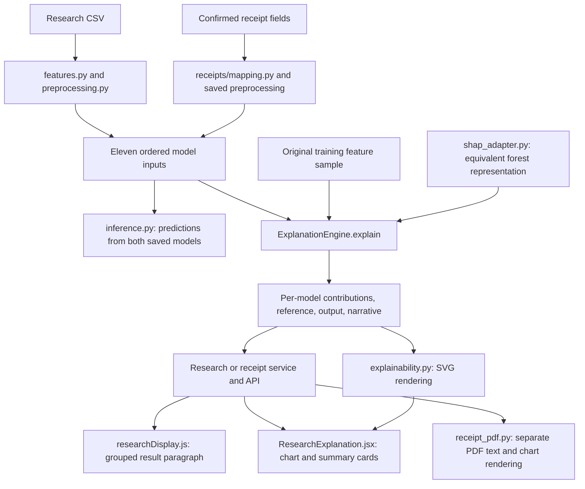

# SHAP explainability in Integritree

This guide explains the SHAP implementation in the current codebase: the inputs it explains, how files interact, how contributions are calculated and stored, how the application generates its text, and how to investigate or change the behavior.

Reviewed against the source on **9 October 2026**. Code links are relative to this document. Function names are provided so you can find them even after line numbers change. Examples with invented numbers are illustrative, not measured model results.

## Contents

1. [What SHAP explains here](#1-what-shap-explains-here)
2. [File map and data flow](#2-file-map-and-data-flow)
3. [The eleven input features](#3-the-eleven-input-features)
4. [Configuration and the reference sample](#4-configuration-and-the-reference-sample)
5. [How the engine calculates an explanation](#5-how-the-engine-calculates-an-explanation)
6. [Why the custom SHAP adapter exists](#6-why-the-custom-shap-adapter-exists)
7. [The explanation data structure](#7-the-explanation-data-structure)
8. [How the text explanations are generated](#8-how-the-text-explanations-are-generated)
9. [Research CSV and receipt workflows](#9-research-csv-and-receipt-workflows)
10. [Charts and the full evaluation modal](#10-charts-and-the-full-evaluation-modal)
11. [Caching, provenance, and exports](#11-caching-provenance-and-exports)
12. [Running offline explanations](#12-running-offline-explanations)
13. [Tests and troubleshooting](#13-tests-and-troubleshooting)
14. [Where to change behavior](#14-where-to-change-behavior)

## 1. What SHAP explains here

Integritree explains the **fraud-class probability** produced by each saved model:

| Internal key | Application name |
| --- | --- |
| `rf` | Benchmark RF |
| `rf_smote` | RF-SMOTE |

Each model gets its own explanation for the same transaction. SHAP does not train either model, select the classification threshold, or determine the ground-truth label.

The central relationship is:

```text
fraud probability = reference score + sum of all eleven SHAP contributions
output_value      = base_value      + sum(features[*].contribution)
```

The implementation verifies this relationship within a numerical tolerance. `base_value` is the model's average fraud output over the SHAP reference sample. It is not automatically the dataset's fraud prevalence, the classification cutoff, or the other model's reference score.

For example, a reference score of `0.10`, positive contributions totaling `0.30`, and negative contributions totaling `-0.05` reconstruct an output of `0.35`. The UI displays that output as `35.00/100` in the result summary and `35.00%` in the modal.

| Value | Interpretation |
| --- | --- |
| Contribution `+0.12` | Raises the model's output by **12 percentage points** relative to its reference. |
| Contribution `-0.08` | Lowers the output by **8 percentage points**. |
| Contribution `0` | No contribution under this explanation. |
| Output `0.35` | The saved model returned a fraud probability of `0.35`; this is not a contribution. |

Classification is a separate comparison: `score >= saved_threshold` means fraud, including an exact tie. Read the threshold from the loaded bundle or response. Although `experiment.yaml` contains a standalone default of `0.5`, a selected model bundle can contain a different cutoff.

These are explanations of **model behavior**, not proof that a transaction detail caused fraud. A negative contribution does not certify legitimacy, and the displayed model probability is not itself evidence of real-world probability calibration.

## 2. File map and data flow



The essential source files are:

| File | Responsibility and important entry points |
| --- | --- |
| [ml/explainability.py](../backend/src/integritree/ml/explainability.py) | Main implementation: `ExplanationEngine`, `create_background`, `readable_features`, `summarize`, `waterfall`, `cached_contribution_chart`, `explain_report`, `main`. |
| [ml/shap_adapter.py](../backend/src/integritree/ml/shap_adapter.py) | `forest_representation`: supplies the tree representation used by TreeExplainer. |
| [ml/features.py](../backend/src/integritree/ml/features.py) | `FEATURE_COLUMNS`, `SCALED_COLUMNS`, `engineer_features`: authoritative feature names and order. |
| [ml/preprocessing.py](../backend/src/integritree/ml/preprocessing.py) | `FittedPreprocessor`: applies the saved training median and Min-Max scaling. |
| [ml/inference.py](../backend/src/integritree/ml/inference.py) | `feature_matrix`, `fraud_scores`, `classify`, `predict_features`: validates inputs and produces the output SHAP must reconstruct. |
| [ml/artifacts.py](../backend/src/integritree/ml/artifacts.py) | `load_bundle`: loads models, preprocessing, configuration, and provenance with integrity checks. |
| [receipts/mapping.py](../backend/src/integritree/receipts/mapping.py) | `receipt_features`, `predict_receipt`: maps confirmed receipt fields into the same feature schema. |
| [services/research.py](../backend/src/integritree/services/research.py) | `ResearchService.explain`, `_explain`, `_record`, `display_waterfall`: schedules explanations and stores them with CSV records. |
| [services/receipts.py](../backend/src/integritree/services/receipts.py) | `_predict`, `_explain`, `retry`, `_contribution_chart`, `export`: receipt explanation lifecycle and revisions. |
| [research routes](../backend/src/integritree/api/routes/research.py) / [receipt routes](../backend/src/integritree/api/routes/receipts.py) | HTTP endpoints and session ownership boundaries. |
| [researchDisplay.js](../frontend/src/researchDisplay.js) | `shapSummaryParts`, `shapSummary`, `SUMMARY_GROUPS`, `RISK_BANDS`: frontend paragraph logic. |
| [ShapSummary.jsx](../frontend/src/components/ShapSummary.jsx) | Renders the paragraph's text fragments and bold/color styling. |
| [ShapModal.jsx](../frontend/src/components/ShapModal.jsx) | Modal wrapper, focus handling, and close behavior. |
| [ResearchExplanation.jsx](../frontend/src/components/ResearchExplanation.jsx) | `ResearchExplanation`, `ContributionChart`, `SummarySection`: full explanation display shared by research and receipts. |
| [services/receipt_pdf.py](../backend/src/integritree/services/receipt_pdf.py) | `shap_summary`, `generate_pdf`, `_shap_page`, `_contribution_graph`: downloaded receipt explanation. |
| [shap_geometry.json](../backend/src/integritree/ml/shap_geometry.json) | Shared SVG/React chart geometry. |
| [experiment.yaml](../backend/configs/experiment.yaml) / [config.py](../backend/src/integritree/config.py) | SHAP policy values and `ShapConfig` validation. |

For a first reading, start with `shapSummaryParts`, then `ExplanationEngine.explain`, then the service for the workflow you are investigating.

## 3. The eleven input features

SHAP explains the **processed inputs actually supplied to the forest**, in the exact order in `FEATURE_COLUMNS`.

| Order | Feature | Research meaning | Frontend narrative group |
| --- | --- | --- | --- |
| 1 | `hour_of_day` | `(step - 1) % 24` | Hour |
| 2 | `day_of_week` | `((step - 1) // 24) % 7` | Day |
| 3 | `type_CASH_IN` | Cash-in indicator | Transaction type |
| 4 | `type_CASH_OUT` | Cash-out indicator | Transaction type |
| 5 | `type_DEBIT` | Debit indicator | Transaction type |
| 6 | `type_PAYMENT` | Payment indicator | Transaction type |
| 7 | `type_TRANSFER` | Transfer indicator | Transaction type |
| 8 | `log_amount` | `log1p(amount)` | Transaction amount |
| 9 | `is_zero_amount` | Whether amount equals zero | Transaction amount |
| 10 | `is_merchant_origin` | Whether origin ID starts with `M` | Sender type |
| 11 | `is_merchant_dest` | Whether destination ID starts with `M` | Recipient type |

Only `log_amount`, `hour_of_day`, and `day_of_week` are scaled. The saved transformation is `scaled = unscaled * scale + offset`; it is not refitted for an explanation and does not clip values to the training range. Raw research inputs with missing amounts use the saved training median. Unknown transaction types produce all-zero type indicators.

For receipts, the mapping obtains hour and weekday from confirmed date/time fields under the receipt's Manila-time convention, and merchant indicators from confirmed roles. It does not fabricate PaySim entity IDs. Research time is a simulation-derived index; a research day index is not evidence of a real calendar weekday.

Actual fraud labels, account balances, transaction IDs, and receipt images are not among these eleven model inputs. SHAP therefore does not assign them contributions. It explains the model's numeric receipt representation, not image pixels or OCR confidence.

`readable_features(values, preprocessor)` reverses scaling for human-readable descriptions. It also reverses `log1p` using `expm1` to describe the amount. The returned text does not change the features or their SHAP contributions.

## 4. Configuration and the reference sample

Current checked-in settings in [experiment.yaml](../backend/configs/experiment.yaml):

| Setting | Value | Effect |
| --- | --- | --- |
| `output_space` | `probability` | Explain probability rather than a raw margin. |
| `perturbation` | `interventional` | Use the explicit background sample when evaluating feature effects. |
| `background_strategy` | `uniform_original_training_without_replacement` | Reference comes from original training rows. |
| `background_size` | `200` | Request 200 reference rows, or all rows if fewer exist. |
| `seed` | `42` | Reproducible background and report sampling. |
| `global_sample_size` | `1000` | Default number of report transactions explained for `sample` scope. |
| `additivity_tolerance` | `0.000001` | Maximum reconstruction error in probability units. |
| `positive_tolerance` | `0.000000001` | Minimum magnitude used by backend contributor summaries. |
| `explanation_coverage` | `on_demand_and_sampled_global_explicit_full_job` | Distinguishes interactive, sampled, and explicitly full explanation work. |

`ShapConfig` allows some unresolved values, but `validate_shap_policy` rejects missing numerical settings and unsupported policies when building the engine. For example, the schema mentions `raw`, but this engine requires `probability`.

`create_background` verifies prepared-data provenance and the training-feature fingerprint, then calls `sample_feature_rows`. That helper chooses seeded row positions without replacement and reads Parquet batches of 25,000 rows rather than loading the whole training matrix.

The reference includes **no SMOTE-generated rows, no deliberate class balancing, and no held-out validation/test rows**. Both models use the same sampled feature rows, but their average predictions and therefore their reference scores can differ.

The engine uses `shap.maskers.Independent(background, max_samples=len(background))` and checks that SHAP retained the requested sample size. The interventional setup is the explanation policy; the code does not establish that the transaction features are causally independent. Related inputs such as one-hot indicators still require careful interpretation.

## 5. How the engine calculates an explanation

### Initialization: `ExplanationEngine.__init__`

1. Validate the policy and load the bundle, unless the caller already supplied one.
2. Create or validate the cached reference sample.
3. Validate reference feature order and convert reference inputs to `float32`.
4. Build an identity containing model/background metadata hashes, policy, SHAP version, implementation hashes, and adapter representation name.
5. For each saved model, create `shap.TreeExplainer(forest_representation(model), masker, model_output="probability", feature_perturbation="interventional")`.
6. Check reference-sample size and verify adapter predictions against `model.predict_proba` on that sample with absolute tolerance `1e-12` and zero relative tolerance.

### Per record: `ExplanationEngine.explain(features, transaction_ids, analysis_id="local")`

1. `feature_matrix` requires the exact eleven columns in order and nonempty, finite numeric data. IDs must be unique, nonempty strings aligned with the rows.
2. Compute readable descriptions once for the record.
3. For each model, calculate a cache key from engine identity, analysis ID, record ID, model key, and feature values.
4. If a completed cache exists, validate file fingerprints and reuse its JSON.
5. Otherwise, explain the record as a `float32` row with `check_additivity=False`.
6. Require SHAP's output shape to be `(1, 11, 2)`. Find the fraud-class position using `model.classes_ == 1`; do not assume class order blindly.
7. Extract eleven fraud-class contributions and the corresponding reference value.
8. Obtain the output independently through `fraud_scores` on the saved estimator.
9. Verify finite contributions/reference and `abs(base + sum(contributions) - score) <= additivity_tolerance`.
10. Generate the top individual positive contributor and backend narrative, compute the prediction using the saved cutoff, render a chart, and save JSON plus a fingerprint manifest.

**Why disable SHAP's built-in additivity check?** The code supplies its own explicit check against the original saved model probability. `check_additivity=False` does not mean that reconstruction is left unchecked.

The return value is a list of per-record/per-model dictionaries. Services turn that list into a `models` mapping for the API. A request for one transaction computes explanations for both saved models; choosing a model tab controls presentation.

## 6. Why the custom SHAP adapter exists

[shap_adapter.py](../backend/src/integritree/ml/shap_adapter.py) documents compatibility constraints of the interventional kernel targeted by this repository's pinned SHAP `0.52.0` dependency: threshold precision and node-index limits.

`forest_representation(model, max_nodes=8192)` addresses these constraints by:

- Adjusting thresholds onto the `float32` grid while preserving the original split decisions for `float32` inputs. Thresholds rounded upward are moved down with `np.nextafter`.
- Converting node class values into probabilities and dividing by the number of forest estimators.
- Partitioning large trees into gated subtree components. Each component returns zero outside its original decision path, and their outputs are summed.
- Returning SHAP's tree-dictionary representation, with probability output and zero base offset.

The adapter does not modify or retrain the saved estimator. Its intended equivalence applies to both predictions and interventional feature attributions through the sum of components. The node limit must be between 64 and 30,000; the current code rejects tree depth above 24.

[test_shap_adapter.py](../backend/tests/test_shap_adapter.py) checks this beyond output reconstruction: it enumerates all feature coalitions for a small three-feature forest and compares each adapted SHAP contribution with an independently calculated result. It also checks prediction equality, component size, and unchanged original thresholds.

Treat changes to this adapter or the pinned SHAP version as numerical implementation changes, not merely presentation changes.

## 7. The explanation data structure

The API wraps per-model engine results like this (schematic, with most feature entries omitted):

```text
explanation
  status: "computed"
  models
    rf
      status: "computed"
      transaction_id, analysis_id, model, model_run_id
      output_space: "fraud_probability"
      base_value, output_value, predicted_label, threshold
      features: [eleven entries]
        feature: "log_amount"
        model_value: the processed numeric input
        readable_value: a human-readable description
        contribution: signed probability contribution
      top_positive_contributor
        status: "available" or "no_positive_contributor"
        feature, contribution: populated or null
      narrative: backend-generated text
      chart_description, chart_version
      additivity_error, elapsed_seconds
      explainer_identity, cache_key
      waterfall_url: session-owned chart endpoint
    rf_smote
      ...the other model's explanation...
```

Internally the engine returns `waterfall_path`, a local file path. Services remove that field and expose `waterfall_url` instead. Receipts also rewrite time descriptions before exposing the explanation.

Do not confuse this runtime dictionary with the smaller `ShapExplanation` class in [contracts.py](../backend/src/integritree/contracts.py). That generic contract uses `output_space: "probability" | "raw"` and a feature `value` field; the actual engine/API payload includes the richer fields above, including `model_value`, `readable_value`, and `"fraud_probability"`.

## 8. How the text explanations are generated

**The explanation text is deterministic, template-based code. These SHAP paths do not call a language model or generate prose through an AI prompt.** There are three separate text builders, which do not currently produce identical paragraphs.

| Surface | Builder | Selection rule |
| --- | --- | --- |
| Backend `narrative` | Python `summarize` in `explainability.py` | Up to two strongest positive and two strongest negative individual features. |
| On-screen result paragraph | JavaScript `shapSummaryParts` in `researchDisplay.js` | Strongest positive feature group, plus other groups exceeding 10 percentage points. |
| Downloaded receipt PDF paragraph | Python `shap_summary` in `receipt_pdf.py` | Up to two positive and two negative individual features, with receipt-friendly text. |

### 8.1 Backend narrative: `summarize`

Inputs are contribution values in feature order, readable descriptions in the same order, and the configured numerical tolerance.

- Positive means `contribution > tolerance`; negative means `contribution < -tolerance`.
- Positive features are sorted from largest to smallest; negatives from most negative upward.
- Ties use the original feature index.
- The largest positive individual feature becomes `top_positive_contributor`.
- The narrative lists up to two features in each direction, multiplying contributions by 100 and describing them as percentage points.
- If no positive feature qualifies, the top status is `no_positive_contributor`.
- The text ends with the explanation-versus-causation reminder and states that the chart includes all features.

`ExplanationEngine.explain` appends a sentence containing the saved cutoff and predicted class. The receipt service subsequently rebuilds `narrative` with `summarize` after changing time descriptions to Manila time; that replacement does **not** append the engine's cutoff sentence again.

`chart_description` adds chart interpretation text and the backend narrative. The frontend uses this as the chart image's alternative text. Thus backend wording can affect accessibility text even when the visible result paragraph is built elsewhere.

### 8.2 On-screen paragraph: `shapSummaryParts`

The call used by result pages is:

```javascript
shapSummaryParts(explanation, model, context, result)
// model: 'rf' or 'rf_smote'
// context: 'research' (default) or 'receipt'
// result: optional saved prediction, e.g. record.rf
```

The function reads `explanation.models[model]`. It prefers `result.score` and `result.predicted_label`, falling back to the explanation's `output_value` and `predicted_label`. It validates score range, label, feature names, and finite contributions before generating the paragraph.

It then **sums signed contributions before ranking**:

```text
transaction type   = sum of all five type_* contributions
transaction amount = log_amount + is_zero_amount
day                = day_of_week
hour               = hour_of_day
sender type        = is_merchant_origin
recipient type     = is_merchant_dest
```

This is a presentation aggregation of already-computed SHAP values. It does not run SHAP again with six input features or compute a separate six-player grouped Shapley game.

The selection rules are precise:

1. Keep groups whose signed total is strictly greater than `1e-9`.
2. Sort by descending contribution, breaking ties in the group order shown above.
3. Always include the strongest remaining group, even if it contributes less than 10 percentage points.
4. Include each additional group only if its total is **strictly greater than `0.10`**, meaning 10 percentage points. Exactly `0.10` is excluded as an additional group.
5. Compare unrounded values. Formatting happens later.

The frontend's `1e-9` is hardcoded; it is not read from `experiment.yaml`. The PDF also hardcodes this tolerance. Changing only the backend configuration will not change all presentation rules.

The opening sentence contains the predicted label, `score * 100` formatted to two decimals, and the risk band. Bands use the unrounded score:

| Score out of 100 | Band |
| --- | --- |
| Below 20 | Minimal Risk |
| 20 to below 40 | Low Risk |
| 40 to below 60 | Moderate Risk |
| 60 to below 80 | High Risk |
| 80 to 100 | Critical Risk |

These bands are presentation categories, separate from the model's saved classification cutoff. The summary uses the supplied prediction; it does not reclassify the transaction using a band or compare the score with `item.threshold` itself.

For a fraud prediction, the leading group "increased the score the most." For a legitimate prediction, the text begins "Although ..." and explains that the final score remained below the classification cutoff. Other qualifying groups "also increased the score."

If no positive group qualifies, the text says none increased the score above the reference. If the supplied label is fraud, it adds that the reference score was already above the cutoff. These statements are generated from grouped contributions and the label; the function does not independently verify the reference/cutoff relationship. The backend's reconstruction check provides the normal consistency guarantee.

Research names day/hour as simulated time. Receipt context uses "day of the week in Manila time" and "hour of the day in Manila time."

The return value is an array such as `{ text, bold?, color? }`. `ShapSummary.jsx` renders those fragments as text and `<strong>` elements. The exported `shapSummary` helper joins the fragments into a plain string, which is useful in tests. Neither function simply displays the backend `narrative`.

### 8.3 Worked example: why two top contributors can differ

Suppose the nonzero contributions are:

| Feature | Contribution | Percentage points |
| --- | --- | --- |
| `type_TRANSFER` | `+0.40` | +40 |
| `type_PAYMENT` | `-0.35` | -35 |
| `log_amount` | `+0.20` | +20 |
| `is_zero_amount` | `-0.08` | -8 |
| `hour_of_day` | `-0.20` | -20 |

Their total is `-0.03`. An illustrative reference of `0.85` therefore reconstructs an output of `0.82`. With a cutoff of `0.43`, the prediction is fraud.

- Backend/modal top individual feature: **Transaction is Transfer**, because `+0.40` is the largest individual positive contribution.
- Frontend transaction-type group: `0.40 - 0.35 = +0.05`.
- Frontend transaction-amount group: `0.20 - 0.08 = +0.12`.
- Frontend top group: **transaction amount**. Type is not added to the paragraph because its net contribution does not exceed `0.10`.

The visible paragraph is:

> The model classified this transaction as Fraudulent, with a fraud risk score of 82.00/100, which falls under the category of Critical Risk. The transaction amount increased the score the most.

That paragraph reports the leading positive group; it does not claim that the total effect of all features was positive. Negative contributions are still present in the chart and backend narrative.

### 8.4 Missing or invalid explanation text

| Condition in `shapSummaryParts` | Display behavior |
| --- | --- |
| No model item, including pending/not requested | "The SHAP explanation is being prepared." |
| No model item and wrapper status is `failed` | Offers opening the full evaluation to retry. |
| Empty features, unknown feature, or nonfinite contribution | "No feature contributions are available for this record." |
| Invalid or missing score/prediction | "The prediction and score are not available for this explanation." |

Validation is a display guard, not a substitute for backend schema checks. For example, the formatter does not itself require all eleven unique features.

### 8.5 Receipt PDF text is separate

`receipt_pdf.shap_summary(explanation, model, derived)` sorts individual contributions in each direction, selects at most two per direction, and uses `feature_text` to describe confirmed receipt values. It formats contributions to two decimal places in percentage points and includes a model-behavior caveat.

It does not use the frontend's six groups, additional-group threshold, or classification-first paragraph. A PDF/on-screen wording difference is therefore possible even with identical SHAP numbers. See the test caveat in [section 13](#13-tests-and-troubleshooting) before relying on an existing parity test.

## 9. Research CSV and receipt workflows

### Research CSV

The main frontend is [TransactionDetailsPage.jsx](../frontend/src/pages/TransactionDetailsPage.jsx).

1. CSV analysis produces paired predictions and saves each record's processed features in `records.sqlite`.
2. Opening a transaction fetches its record. If explanation status is `not_requested`, the page automatically POSTs an explanation request. The user does not have to open the SHAP modal to start calculation.
3. `ResearchService.explain` returns existing `computed`/`pending` state or queues `_explain` and returns `pending`.
4. `_explain` lazily initializes the shared engine, loads that record's saved features, and explains both models.
5. The service adds chart URLs and stores `{status: "computed", models: ...}` in SQLite. Failure is recorded as retryable explanation state.
6. The page polls at 1,200 ms while pending, then renders the paragraph. The modal shows the selected model's stored explanation.

Research uses `X-Research-Session`, supplied by [researchApi.js](../frontend/src/researchApi.js).

| Method | Endpoint relative to `/api/v1/research` | Purpose |
| --- | --- | --- |
| GET | `/analyses/{id}/records/{number}` | Record, prediction, and current explanation state. |
| POST | `/analyses/{id}/records/{number}/explanation` | Queue calculation or retry a failed explanation; HTTP 202. |
| GET | `/analyses/{id}/records/{number}/waterfall/{model}` | Fetch SVG; supports `layout=modal` and `presentation=row_number`. |

Opening the modal after failure exposes a retry button. The page increments its revision state, then requests the explanation again. Retrying a failed chart fetch is a separate operation from retrying SHAP calculation.

### Confirmed receipt

The main frontend is [UserResultsPage.jsx](../frontend/src/pages/UserResultsPage.jsx), with polling in [useReceipt.js](../frontend/src/useReceipt.js).

1. The receipt workflow obtains confirmed fields and calls `predict_receipt`.
2. The service stores predictions, unscaled display features, and scaled model inputs, with explanation status `pending`.
3. `_predict` calls `_explain` automatically. Receipt explanation is part of processing the confirmed transaction.
4. The engine uses the same saved models/reference policy and the scaled receipt features. The analysis identity includes the receipt revision.
5. The service changes hour/day descriptions to Manila time, rebuilds backend summary text, renders receipt charts, and exposes both models.
6. The result page supplies `context="receipt"` to `ShapSummary` and `receiptApi` to the modal. Busy receipt jobs are polled at 900 ms.

Receipt routes use `X-Receipt-Session`, supplied by [receiptApi.js](../frontend/src/receiptApi.js):

| Method | Endpoint relative to `/api/v1/receipts` | Purpose |
| --- | --- | --- |
| GET | `/{id}` | Job/result state. |
| POST | `/{id}/retry` | Retry eligible failed processing or a failed explanation. |
| GET | `/{id}/waterfall/{model}?revision={revision}` | Current revision's SVG; also accepts `layout=modal`. |
| GET | `/{id}/download?revision={revision}` | Receipt results ZIP containing a PDF. |

If SHAP fails, saved predictions remain available and the receipt can complete with a failed explanation. Reconfirmation creates a new revision; chart/download access checks reject an outdated revision or a busy result.

## 10. Charts and the full evaluation modal

Despite legacy names such as `waterfall`, `waterfall_path`, and `/waterfall/...`, the current chart is a **signed contribution bar chart**, not a cumulative waterfall plot.

`waterfall` locks rendering and delegates to `_render_waterfall`. The renderer:

- Uses fixed `FEATURE_COLUMNS` order, not contribution ranking.
- Converts contributions to percentage points by multiplying by 100.
- Draws positive bars to the right in red (`#A00000`) and negative bars to the left in green (`#009900`).
- Uses a fixed SVG axis from -100 to +100 with ticks every 10 percentage points.
- Leaves exactly zero contributions blank; very small nonzero contributions retain a visible hairline.
- Uses `standalone` layout for labels, title, and summary cards, or `modal` layout for the plot/ticks while React supplies labels and cards.

[shap_geometry.json](../backend/src/integritree/ml/shap_geometry.json) is imported by both Python and React. Current values include 80 pixels per 10-point interval, 40-pixel rows, 100-pixel endpoint padding, 8-pixel top padding, and 40-pixel tick height. The modal SVG is therefore 1,800 pixels wide and, with eleven rows, 488 pixels high. Horizontal scrolling exposes the chart; a newly loaded image centers the view around zero.

`ResearchExplanation` displays three summary sections:

| Section | Data source |
| --- | --- |
| Reference Score | `base_value * 100`, two decimals and `%`. |
| Output Score | `output_value * 100`, two decimals and `%`. |
| Top Risk-Increasing Contributor | Backend `top_positive_contributor`, mapped through `SHAP_FEATURE_LABELS`. |

The modal top contributor is an individual feature. It does not use `SUMMARY_GROUPS`.

Receipt PDFs render their own chart directly from saved contributions. `contribution_ticks` chooses **nine adaptive gridlines**, using 10-, 20-, or 25-point spacing to contain zero and all contributions. This differs from the fixed full SVG axis; changes to the SVG renderer do not automatically alter PDF layout.

## 11. Caching, provenance, and exports

There are three cache layers:

| Layer | Identity and contents |
| --- | --- |
| Reference sample | `background_<digest>/features.parquet` and `metadata.json`; keyed by prepared/training fingerprints, strategy, requested size, and seed. |
| Explanation | `records/<cache_key>/explanation.json`, `waterfall.svg`, and `manifest.json`; keyed by engine identity and record/model inputs. |
| Presentation SVG | `contribution_bars_v3_<digest>.svg`; keyed by model, record, features, base/output values, display label, layout, and top contributor. |

The engine identity includes hashes of `explainability.py` and `shap_adapter.py`, the SHAP version, policy, and model/background metadata. Cache hits validate explanation/chart hashes. An incomplete or incompatible reference cache is rejected rather than silently trusted.

Services reuse an initialized engine and switch its record cache root to the active job or receipt revision. Research auxiliary jobs use a single-worker executor. The current ownership and scheduling arrangement matters because `engine.cache_root` is mutable; do not introduce parallel shared-engine jobs without reviewing it.

`cached_contribution_chart` can render a new presentation from stored contributions without running SHAP again. It writes a temporary SVG and then replaces the target. `CHART_VERSION` provides an explicit presentation version; geometry is not itself included in the presentation digest, so version changes matter when updating rendering.

Interactive results are temporary/session-owned. Cache reuse does not imply permanent user storage.

The export paths have different scopes:

- **Research UI ZIP:** current `_export` writes the raw-results CSV and generated experiment-paper PDF. It records SHAP coverage and identity in export status metadata, but does not add per-record explanation JSON/SVG files to that ZIP. Exporting does not automatically explain every uploaded row.
- **Receipt ZIP:** contains four PDF pages: Benchmark RF results, Benchmark RF SHAP evaluation, RF-SMOTE results, RF-SMOTE SHAP evaluation. It renders from a copied saved result, without rerunning SHAP, and can show unavailable-explanation messaging while preserving predictions.
- **Offline explanation report:** contains `explanations.jsonl`, `explained_records.csv`, `global_summary.json`, and `metadata.json`, with per-record charts stored in the explanation cache.

## 12. Running offline explanations

[scripts/explain_models.py](../backend/scripts/explain_models.py) calls `explainability.main`. The installed console entry point is `integritree-explain`.

Use an existing compatible model bundle, prepared dataset, and evaluation report. These are placeholders to replace with actual folders. From `backend`, with the backend environment activated:

```powershell
python scripts/explain_models.py --models "artifacts/YOUR_MODEL_RUN" --prepared "data/prepared/YOUR_PREPARED_RUN" --report "reports/YOUR_EVALUATION_RUN" --scope preview --limit 1
```

| Scope | Behavior |
| --- | --- |
| `preview` | Seeded sample of `--limit` transactions; defaults to one. |
| `sample` | Seeded sample of up to `global_sample_size` transactions; this is the default scope. |
| `full` | Every transaction in the existing report. |

`--limit` is accepted only for `preview` and must be positive. Other options include `--config` and `--run-id`. Relative paths are resolved against the configured backend root. Reports go to `settings.reports_dir`; the CLI cache goes to `settings.artifacts_dir / "explanation_cache"`.

`explain_report` verifies model/preparation/report compatibility, matches selected records by source row number, and checks order alignment. Test-split explanations require the bundle's frozen selection stage (`validation_selected`). SHAP is not automatically triggered by validation selection.

`global_summary.json` reports mean absolute SHAP contribution per feature and model over the explained transactions:

```text
mean_absolute_shap(feature) = mean(abs(contribution for that feature))
```

This measures average contribution magnitude, not direction. Values remain in probability units. A sampled report is explicitly labeled as a sample; it is not evidence that every population row was explained.

## 13. Tests and troubleshooting

Useful existing tests:

| Test file | What it exercises |
| --- | --- |
| [test_shap_adapter.py](../backend/tests/test_shap_adapter.py) | Adapter prediction equivalence and independent coalition-based attribution comparison. |
| [test_phase4_workflows.py](../backend/tests/test_phase4_workflows.py) | Real TreeSHAP reconstruction, both models, cache reuse/invalidation, and preview coverage. |
| [test_contribution_chart.py](../backend/tests/test_contribution_chart.py) | Signed charts, rendering geometry, zero/tiny contributions, and presentation cache migration. |
| [test_research_api.py](../backend/tests/test_research_api.py) | Research explanation/API/chart/export integration. |
| [test_receipt_api.py](../backend/tests/test_receipt_api.py) | Receipt lifecycle, explanations, revision checks, and exports. |
| [test_receipt_pdf.py](../backend/tests/test_receipt_pdf.py) | PDF output, unavailable SHAP, chart behavior, and a display-parity test. |
| [shap-summary.spec.js](../frontend/e2e/shap-summary.spec.js) | Signed grouping, strict 10-point boundary, ties, receipt context, prediction override, and invalid states. |
| [research-display.spec.js](../frontend/e2e/research-display.spec.js) | Modal contents, scrolling, labels, responsive display, and explanation states. |

Focused commands, run from the corresponding directory with dependencies installed:

```powershell
# From backend, using its activated Python environment:
python -m pytest tests/test_shap_adapter.py tests/test_phase4_workflows.py::test_real_tree_shap_cache_reconstruction_and_coverage tests/test_contribution_chart.py -q

# From frontend; these formatter tests do not require a running application:
npm run test:e2e -- e2e/shap-summary.spec.js
```

Browser integration tests additionally need the application/test environment described in the repository setup documentation.

Verification when this guide was written: the focused commands above passed **10 backend tests and 7 frontend formatter tests**. The backend emitted three SHAP/Matplotlib pending-deprecation warnings. All local links and contents anchors in this guide were checked. The full API, browser, and PDF suites were not run for this documentation change.

**Existing parity-test caveat:** `test_display_parity_with_frontend_using_shared_synthetic_cases` in `test_receipt_pdf.py` still calls JavaScript as `shapSummary(explanation, 'rf', derived, 'receipt')`. The current JavaScript signature is `(explanation, model, context, result)`, and the current PDF and frontend text builders use different algorithms. The presence of this test should not be taken as proof that their paragraphs currently match. This guide documents the implementation; it does not change that test or either formatter.

| Symptom | Where to investigate |
| --- | --- |
| Paragraph stays "being prepared" | Record/job status, research POST/polling, receipt busy state, then backend explanation logs. |
| Explanation fails but prediction exists | `_explain` exception logs; bundle/reference fingerprints, dependencies, policy, or reconstruction failure. |
| Feature columns/order error | Compare supplied dataframe columns with `FEATURE_COLUMNS`; pass saved processed inputs, not arbitrary raw/display columns. |
| Reconstruction error | Check adapter compatibility, model identity, input precision, background integrity, and `additivity_error`; avoid simply increasing tolerance. |
| Paragraph and modal name different top factors | Check signed group totals versus the largest individual positive contribution. This can be expected. |
| A small positive factor is absent from the paragraph | Check group cancellation and the strict `> 0.10` rule for additional groups. |
| Zero-looking bar still appears | SVG renders any nonzero value; numerical summary tolerances and rounded labels serve different purposes. |
| Chart fails while paragraph works | Check SVG endpoint/session header, requested revision, chart response, and rendering errors. Use Retry chart first. |
| Receipt chart/download returns 409 | Confirm the result is complete, not busy, and the requested revision is current. |
| CSV ZIP lacks all SHAP explanations | Current research export does not package per-record SHAP artifacts. Use the offline explanation workflow for explicit report coverage. |
| Changing backend narrative does not change visible paragraph | Edit `shapSummaryParts`; the visible frontend text is generated independently. |
| PDF wording differs from browser | Inspect `receipt_pdf.shap_summary` separately from the frontend formatter. |

## 14. Where to change behavior

| Desired change | Files/functions to review |
| --- | --- |
| Result paragraph wording, grouping, or which factors appear | `researchDisplay.js`: `SUMMARY_GROUPS`, `shapSummaryParts`; update `shap-summary.spec.js`. |
| Paragraph bold/color styling | `ShapSummary.jsx` and fragment properties from `shapSummaryParts`. |
| Risk-band names/boundaries | `researchDisplay.js`: `RISK_BANDS`; also `receipt_pdf.py`: `BANDS` for PDF consistency. Keep classification cutoff logic separate. |
| Backend narrative or individual top contributor | `explainability.py`: `summarize`; review receipt `_explain`, which regenerates it. |
| Human-readable input values | `readable_features`, receipt `_explain`, and PDF `feature_text`. |
| Modal heading/help/summary values | `ResearchExplanation.jsx`; modal behavior in `ShapModal.jsx`. |
| SVG appearance or spacing | `_render_waterfall`, `shap_geometry.json`, `ShapModal.css`, and `CHART_VERSION`; check React/SVG alignment. |
| PDF explanation wording or layout | `receipt_pdf.py`: `shap_summary`, `_shap_page`, `_contribution_graph`, `contribution_ticks`. |
| Background sampling or numerical policy | `experiment.yaml`, `ShapConfig`, `validate_shap_policy`, `create_background`; review cache identity and hardcoded frontend/PDF tolerances. |
| Core attribution calculation | `ExplanationEngine` and `forest_representation`; run numerical and adapter tests. |
| Features or their order | `features.py`, preprocessing, receipt mapping, model artifacts, label maps, narrative groups, and tests. This changes the model input contract and requires compatible models/data. |
| When explanations are requested | `TransactionDetailsPage.jsx`, research service, receipt service, and receipt polling. |
| Full-dataset explanation coverage | `explain_report` and CLI scope; UI export alone does not provide it. |

For a thesis walkthrough, trace one transaction in this order: **confirmed/raw input -> eleven processed features -> saved model score -> shared reference sample -> eleven signed contributions -> reconstruction check -> individual and grouped summaries -> chart/API/display**. Keep the distinction between the model's score, its classification cutoff, and its explanation visible throughout.

Related documentation: [ML pipeline](ML_PIPELINE_EXPLAINED.md), [methodology](METHODOLOGY.md), [Phase 4 implementation](PHASE4_IMPLEMENTATION.md), [API](API.md), and [receipt mapping](RECEIPT_MAPPING.md).
