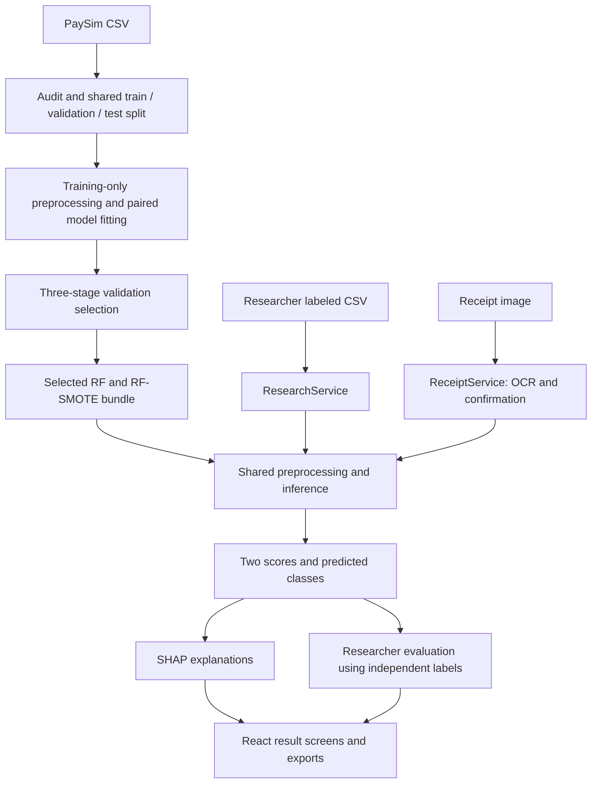

# Integritree code and system guide

Checked against the local implementation on **2026-10-01**. Start with the
[study index](STUDY_GUIDE.md), consult [terms](STUDY_TERMS.md), and use the
[methodology guide](STUDY_METHODOLOGY_GUIDE.md) for experiment decisions.

## 1. Architecture: three activities sharing one model implementation

Integritree separates offline model preparation/selection from application
inference. Application requests load the selected pair and saved preprocessing;
they do not retrain or search for a new cutoff.



The test partition is reserved during selection; it is not an input to the
validation stages shown above. Receipt results have no independent fraud label,
so they do not pass through the labeled performance-evaluation branch.

## 2. Tech stack and each part's job

The versions below are declarations from the package files, not a new audit of
everything installed on the workstation. Lockfiles record resolved versions.

| Layer | Technology | Job |
| --- | --- | --- |
| Browser application | JavaScript, React 19, JSX, CSS | Pages, forms, state, and reusable components. |
| Navigation | React Router 7 | Maps browser URLs to page components. |
| Development/build | Vite 8 | Serves the UI, builds assets, and proxies `/api` requests to the backend. |
| Charts | Recharts 3; backend-generated SVG | UI charts and generated SHAP waterfalls. |
| Uploads/visuals | react-dropzone, Motion, GSAP, AOS, particles.js, icon libraries | File input, animation, and visual presentation. |
| Backend runtime | Python 3.12 | Shared application and research implementation. |
| HTTP server | FastAPI, Uvicorn | Routes requests, runs application lifecycle, serves responses. |
| Validation/settings | Pydantic 2, pydantic-settings, PyYAML | Data contracts, environment settings, experiment configuration. |
| Data processing | NumPy, pandas, PyArrow | Numeric arrays, tables, CSV handling, and Parquet data. |
| Modeling | scikit-learn, imbalanced-learn | Random Forest, preprocessing, stratified splits, and ordinary SMOTE. |
| Persistence | joblib, JSON, Parquet, SQLite, local files | Serialized models, metadata, prepared data, temporary researcher records. |
| Evaluation | scikit-learn, SciPy, project metric code | AP, metric calculations, chi-square/binomial calculations. |
| Explainability | SHAP 0.52.0, custom tree adapter, Matplotlib | Probability-space explanations and SVG waterfalls. |
| Receipt extraction | RapidOCR with ONNX Runtime CPU; Pillow for image handling | Local image reading and OCR; OCR dependencies are isolated. |
| Receipt presence | WebSockets | Keeps track of browser connections for session cleanup. |
| Verification | pytest, HTTPX, Playwright, ESLint | Backend tests, HTTP checks, browser tests, and JS linting. |

Sources: [frontend/package.json](../frontend/package.json),
[backend/pyproject.toml](../backend/pyproject.toml),
[development lock](../backend/requirements-dev.lock), and
[OCR setup/evidence](RECEIPT_OCR_BENCHMARK.md).

Tesseract exists as an OCR comparison engine. It is not the selected application
extraction path. Do not combine the isolated OCR dependency snapshot with the
frozen ML environment when following setup instructions.

## 3. File structure

```text
Integritree/
├── README.md                         Project overview
├── paysim_*.csv                       Root-level data/demo files
├── package-lock.json                 Root npm lockfile; frontend has its own package
├── docs/                             Research decisions, workflows, and these guides
├── frontend/
│   ├── package.json                  JS dependencies and runnable scripts
│   ├── vite.config.js                React plugin and HTTP/WebSocket API proxy
│   ├── playwright.config.js          Browser test configuration
│   ├── eslint.config.js              Lint rules
│   ├── index.html                    Browser document entry
│   ├── public/                       Public logo and particle configuration
│   ├── e2e/                          Receipt/research browser tests
│   └── src/
│       ├── main.jsx                  React startup
│       ├── App.jsx                   Page routing and receipt lifecycle wrapper
│       ├── index.css                 Global styles
│       ├── pages/                    Complete screens
│       ├── components/               Shared UI and visualizations
│       ├── assets/                   Images, SVGs, fonts
│       ├── researchApi.js            Research HTTP/session/upload/export helpers
│       ├── receiptApi.js             Receipt HTTP/presence/cleanup helpers
│       ├── researchDisplay.js        Score, feature, and SHAP display helpers
│       ├── receiptDisplay.js         Workflow/category defaults and date/time labels
│       └── useReceipt.js             Receipt status and image hooks
└── backend/
    ├── pyproject.toml                Python package and CLI entry points
    ├── requirements-*.lock           Pinned dependency sets
    ├── .env.example                  Application settings example
    ├── configs/                      Experiment, selection, dependency constraints
    ├── scripts/                      Thin command entry points and utilities
    ├── tests/                        Unit/integration tests and browser fixture app
    ├── data/raw/                     Original data and retained receipt samples
    ├── data/prepared/                Prepared splits and preprocessing evidence
    ├── artifacts/                    Fitted models and selected bundle manifests
    ├── reports/                      Research results and verification outputs
    ├── runtime/                      Temporary application data and local OCR tools
    └── src/integritree/
        ├── settings.py               Paths, environment variables, allowed origins
        ├── config.py                 Experiment configuration contracts
        ├── contracts.py              Shared typed data contracts
        ├── api/main.py               FastAPI factory and service lifecycle
        ├── api/schemas.py            API response contracts
        ├── api/routes/               Researcher and receipt HTTP handlers
        ├── services/                 Job coordination and application evaluation
        ├── ml/                       Preparation, training, selection, inference, SHAP
        └── receipts/                 OCR, layout checks, confirmation, feature mapping
```

`node_modules/`, `.venv/`, build output, and test caches are generated environments
or outputs. They are not where application features should be edited. Most local
datasets, fitted models, reports, and runtime contents are ignored by Git, with
`.gitkeep` files preserving directory structure. A source checkout alone may not
contain the models and data needed for inference.

The root CSV filenames do not automatically establish held-out membership. The
final evaluation needs the research provenance described in the methodology guide.

### Main frontend routes

These are defined in [App.jsx](../frontend/src/App.jsx).

| Browser path | Component | Purpose |
| --- | --- | --- |
| `/` | `LandingPage` | Entry page. |
| `/upload` | `UploadPage` | Receipt image upload. |
| `/results` | `UploadDetails` | Receipt extraction review and confirmation. |
| `/user-results` | `UserResultsPage` | Paired receipt predictions and explanations. |
| `/researcher-upload` | `ResearcherUploadPage` | Labeled transaction CSV upload. |
| `/researcher` | `ResearcherResultsPage` | Evaluation, model comparison, and transaction table. |
| `/researcher/transaction/:id` | `TransactionDetailsPage` | Individual researcher record details. |

The URL `/results` is the confirmation page despite its name. Follow the actual
route/component mapping rather than inferring behavior from a filename alone.

## 4. Startup and shared dependencies

[create_app()](../backend/src/integritree/api/main.py) loads application settings
and experiment configuration. Its lifespan creates `ResearchService` and then
`ReceiptService`, giving the receipt service `ResearchService.get_bundle` as its
model provider. This makes both workflows use the same selected model pair.
The services close and clean their temporary data when the application shuts down.

Models are loaded lazily. A successful `/api/v1/health` response confirms that
the application responds; it does not prove OCR or the selected model is ready.

Only research and receipt routers are registered, plus health. Both application
workflows use the shared inference implementation under `ml/`; there is no
separate generic prediction endpoint or standalone batch-prediction command.

### Three kinds of configuration

| Location | What it controls |
| --- | --- |
| [settings.py](../backend/src/integritree/settings.py) and `.env` | Local paths, selected model/prepared directories, OCR interpreter, and CORS origins. Environment keys start with `INTEGRITREE_`. |
| [experiment.yaml](../backend/configs/experiment.yaml) | Shared feature, seed, evaluation, and SHAP policies plus generic standalone-fit defaults. |
| [validation_three_stage.yaml](../backend/configs/validation_three_stage.yaml) | Versioned ratio, forest, threshold candidate rules. |
| Saved selected bundle | The finalized ratio, forests, common cutoff, artifact references, and verified provenance used by inference. |

The standalone configuration contains depth 20, SMOTE ratio 1.0, and cutoff 0.5.
The selected pair uses depth 10, ratio 0.01, and cutoff 0.43. These values have
different roles. Read the selected bundle for current inference; do not change
generic defaults to rewrite historical model evidence.

## 5. Walk through a researcher upload

1. `ResearcherUploadPage` calls `uploadCsv()` in
   [researchApi.js](../frontend/src/researchApi.js). The helper obtains a session
   token and sends the CSV bytes, filename, and `X-Research-Session` header.
2. [The research upload route](../backend/src/integritree/api/routes/research.py)
   streams the body to temporary disk, enforces the 500 MiB limit, and calculates
   its SHA-256. It reserves/submits a job and returns HTTP 202.
3. `ResearchService._run()` parses and validates the CSV. `_batch()` handles
   bounded batches and validates labels separately. Raw records receive saved
   preprocessing; prepared features bypass it. Both paths call paired inference.
   Records and scores go into SQLite.
4. `evaluate_database()` computes metrics over the entire upload, including
   score-grouped AP and paired McNemar results. Invalid input fails the analysis;
   the system does not publish partial metrics as if the upload succeeded.
5. The frontend polls status and retrieves paginated records. Search/filtering
   affects visible records, not the full-upload metric population.
6. Requests for displayed/opened transaction explanations reach
   `ResearchService.explain()` and `ExplanationEngine.explain()`.
7. Download starts an export job. The ZIP contains results CSV, evaluation JSON,
   provenance metadata, and an offline HTML report.

Raw upload columns are `step,type,amount,nameOrig,nameDest,isFraud`.
The five remaining original PaySim columns are optional source information;
arbitrary additional columns are rejected. Source identifiers and labels are
kept for identity/evaluation, not passed directly into the forest.

Prepared CSV uploads instead contain exactly the eleven `FEATURE_COLUMNS` plus
`isFraud`, in any order, without an index column. Header detection selects the
format. Prepared features are validated and passed directly to the models without
preprocessing. They must already match the selected model's saved transformations.
The ground-truth label stays separate from predictors. See
[Researcher workflow](RESEARCHER_WORKFLOW.md#csv-inputs-and-capacity) for the full
schema, display behavior, and export rules.

```text
Source predictors ── saved preprocessing ── eleven numeric features ── RF + RF-SMOTE
                                                                       │
Independent isFraud labels ─────────────────────────────────────── evaluation
```

Important API paths under `/api/v1/research`:

| Method/path | Purpose |
| --- | --- |
| `POST /sessions` | Create temporary browser session. |
| `POST /analyses?filename=...` | Upload CSV and start analysis. |
| `GET /analyses/{id}` | Read job status/results summary. |
| `GET /analyses/{id}/records` | Retrieve paginated/filterable records. |
| `POST /analyses/{id}/records/{number}/explanation` | Request paired SHAP. |
| `POST /analyses/{id}/exports` | Start ZIP creation. |
| `GET /analyses/{id}/exports/download` | Download completed ZIP. |
| `DELETE /analyses/{id}` | Clear the analysis. |

Full operating details: [RESEARCHER_WORKFLOW.md](RESEARCHER_WORKFLOW.md).

## 6. Walk through a receipt

1. `uploadReceipt()` obtains a receipt session and establishes WebSocket presence,
   then sends one PNG/JPEG. The server enforces 10 MiB and 20 million decoded pixels.
2. `ReceiptService._ocr()` validates the image, calls the isolated local extractor,
   checks layout anchors, and saves a `ReceiptSource` with extracted candidates
   and immutable source observations.
3. Unsupported or ambiguous layouts stop here. Missing extracted fields remain
   blank for completion after a supported layout is recognized.
4. `UploadDetails` presents reference, principal amount, category, Manila date,
   time, sender type, and recipient type. Proceed submits confirmed fields and
   `expected_revision`.
5. `ReceiptService.confirm()` checks ownership, state, revision, and stored image
   hash. `confirm_receipt()` validates the contract and creates the next revision.
   Older derived results are retired before the new prediction starts.
6. `receipt_features()` derives the eleven **unscaled** features directly from
   confirmed fields. It does not fabricate a PaySim `step` or account ID.
7. `predict_receipt()` calls `transform_engineered()` once, then
   `predict_features()` with both saved models and the saved threshold.
8. `_explain()` attempts both SHAP explanations. The UI shows predictions,
   score bands, a threshold marker, and waterfalls. Explanation failure is explicit
   and retryable; it does not erase an available prediction or invent a chart.
9. Download exports the current revision. Clear or leaving the flow invalidates
   access; session presence and shutdown/startup also control cleanup.

```text
uploading → queued → extracting → awaiting_confirmation
                                  ↓ Proceed
                              predicting → explaining → complete

Possible branches: unsupported layout; failed work with retry; Clear/expiration.
```

The principal and time mapping are experimental assumptions: numerical PHP amount
excluding fees, Asia/Manila hour, and weekday Monday=0. Saved scaling is reused.
User-selected Client/Merchant roles supply the two merchant indicators.

Important paths under `/api/v1/receipts`:

| Method/path | Purpose |
| --- | --- |
| `POST /sessions` | Create session. |
| `WS /sessions/presence` | Track authenticated browser presence. |
| `POST ?filename=...` | Upload image and start extraction. |
| `GET /{id}` | Status, candidates, confirmed fields, and available result. |
| `POST /{id}/confirm` | Confirm fields at expected revision. |
| `POST /{id}/retry` | Retry eligible failed work. |
| `GET /{id}/waterfall/{model}?revision=N` | Current revision's computed SVG. |
| `GET /{id}/download?revision=N` | Current revision's ZIP. |
| `DELETE /sessions/current` | Clear session and retire its receipt data. |

The receipt ZIP includes confirmed inputs, paired results, explanations, metadata,
and computed SVGs. It excludes the original image and evaluation metrics.
See [the complete receipt contract](RECEIPT_APPLICATION.md#http-contract).

## 7. Important functions to study

The tables give a reading path, not every helper. A leading underscore usually
indicates an internal worker/helper rather than a public API endpoint.

### Research preparation, training, and selection

| File / function | Responsibility and important rule |
| --- | --- |
| [data.py](../backend/src/integritree/ml/data.py): `audit_source()` | Checks source identity/validity and exact duplicates; preserves source row identities. |
| `data.py`: `stratified_membership()` | Creates shared train/validation/test membership from labels. |
| [preparation.py](../backend/src/integritree/ml/preparation.py): `prepare_dataset()` | Coordinates audit, splits, training-only preprocessing, prepared files, and provenance. |
| [features.py](../backend/src/integritree/ml/features.py): `validate_predictors()` | Accepts exactly the five source predictor columns and reports invalid values. |
| `features.py`: `engineer_features()` | Derives eleven ordered features using explicit formulas and a supplied training median. |
| [preprocessing.py](../backend/src/integritree/ml/preprocessing.py): `FittedPreprocessor.fit_batches()` | Learns scaling from training batches only. |
| `FittedPreprocessor.transform()` | Engineers source inputs and applies saved scaling without fitting again. |
| `FittedPreprocessor.transform_engineered()` | Validates and scales already-engineered internal inputs once; used by the receipt adapter. |
| [training.py](../backend/src/integritree/ml/training.py): `resample_training()` | Applies float64 ordinary SMOTE and audits counts/fractional indicators. |
| `training.py`: `train_models()` | Fits/saves a matched model pair, with verified reuse where supported. |
| [staged_selection.py](../backend/src/integritree/ml/staged_selection.py): `select_three_stage()` | Coordinates frozen ratio, forest, and cutoff decisions, checkpoints, and evidence. |
| `choose_ratio()` / `choose_forest()` | Apply the specified objective and deterministic tie ordering. |
| [threshold_search.py](../backend/src/integritree/ml/threshold_search.py): `percent_grid_thresholds()` | Sweeps 100 cutoffs using sorted scores/counts and exact rational mean-F1 comparison; no refitting. |
| [artifacts.py](../backend/src/integritree/ml/artifacts.py): `load_bundle()` | Loads verified fitted/selected artifacts and preprocessing. |
| `staged_selection.py`: `load_staged_selected()` | Resolves and verifies the completed selection and its referenced candidate models. |

### Prediction, metrics, and explanation

| File / function | Responsibility and important rule |
| --- | --- |
| [inference.py](../backend/src/integritree/ml/inference.py): `feature_matrix()` | Enforces exact feature names/order and nonempty finite values. |
| `fraud_scores()` | Selects the class-1 probability column using `model.classes_`; validates range and finiteness. |
| `classify()` | Applies `score >= threshold`; equality is fraud. |
| `predict_features()` | Produces both models' scores and labels for aligned unique transaction IDs. |
| `predict_records()` | Convenience path from source predictors through saved preprocessing to paired inference. |
| [evaluation.py](../backend/src/integritree/ml/evaluation.py): `metrics()` | Computes confusion counts, precision, recall, F1, MCC, AP, and accuracy with undefined-value reasons. |
| `comparison()` / `mcnemar()` | Produce descriptive differences / paired error-rate significance results. |
| `evaluate_pair()` | Combines two score vectors and the independent labels into one evaluation. |
| [research_metrics.py](../backend/src/integritree/services/research_metrics.py): `evaluate_database()` | Uses SQLite to evaluate large uploads without loading all records into one array; tested for policy parity. |
| [explainability.py](../backend/src/integritree/ml/explainability.py): `create_background()` | Builds/verifies the shared original-training reference sample. |
| `ExplanationEngine.explain()` | Computes/caches both model explanations and verifies baseline plus contributions reconstructs the score. |
| `summarize()` / `waterfall()` | Create deterministic contributor prose / the rendered explanation chart. |
| [shap_adapter.py](../backend/src/integritree/ml/shap_adapter.py): `forest_representation()` | Supplies a prediction-equivalent internal tree representation for the explanation engine. It does not retrain the forest. |

### Application and receipt coordination

| File / function | Responsibility |
| --- | --- |
| [api/main.py](../backend/src/integritree/api/main.py): `create_app()` | Builds the application and connects the two services to shared model loading. |
| [services/research.py](../backend/src/integritree/services/research.py): `get_bundle()` | Lazily loads/caches the trusted selected bundle. |
| `ResearchService._run()` / `_batch()` | Parse the upload and perform batched preprocessing, prediction, and SQLite storage. |
| `ResearchService.records()` / `export()` | Read paginated records / schedule whole-upload export. |
| [receipts/gcash.py](../backend/src/integritree/receipts/gcash.py): `parse_candidates()` | Converts OCR lines into candidate receipt fields. |
| [receipts/layouts.py](../backend/src/integritree/receipts/layouts.py): `identify_layout()` | Decides whether the OCR matches a supported screenshot workflow. |
| [receipts/contracts.py](../backend/src/integritree/receipts/contracts.py): `confirm_receipt()` | Builds a validated, revisioned confirmation linked to the source image. |
| [receipts/mapping.py](../backend/src/integritree/receipts/mapping.py): `receipt_features()` / `predict_receipt()` | Derive confirmed features / apply saved scaling and paired inference. |
| [services/receipts.py](../backend/src/integritree/services/receipts.py): `confirm()` | Checks current job/revision/image and schedules a new confirmed prediction. |
| `ReceiptService.attach()` / `detach()` / `reap()` | Track connections and expire inactive sessions after grace. |
| [receiptApi.js](../frontend/src/receiptApi.js): `connectPresence()` / `clearReceipt()` | Maintain receipt presence / clear server and browser receipt state. |
| [useReceipt.js](../frontend/src/useReceipt.js): `useReceipt()` | Keeps UI receipt status updated through requests. |
| [researchApi.js](../frontend/src/researchApi.js): `uploadCsv()` / `downloadAnalysis()` | Browser upload progress/session handling / export-and-download flow. |

### A small inference example

This is an illustrative reading example, not a real transaction or measured result:

```python
# Equivalent flow using the existing helpers; bundle is already verified/loaded.
features = bundle.preprocessor.transform(source_predictors)
predictions = predict_features(
    bundle.models,
    features,
    transaction_ids,
    bundle.config.scoring.threshold,
    bundle.metadata["run_id"],
)
```

`source_predictors` must contain the five source columns. `features` contains
eleven ordered model columns. `isFraud` is not in either object. Evaluation receives
that label separately after prediction. Receipt callers instead generate their
features from confirmation and call `transform_engineered()`.

## 8. Temporary storage and ownership

| Detail | Researcher | Receipt |
| --- | --- | --- |
| Header | `X-Research-Session` | `X-Receipt-Session` |
| Storage | `runtime/research_sessions/` | `runtime/receipt_sessions/` |
| Refresh | Preserves browser session token. | Preserves token/draft; presence reconnects within grace. |
| Closing browser | Does not itself clean backend analysis files. | Last presence disconnect starts a 30-second grace period. |
| Clear | Deletes analysis after active work finishes. | Invalidates access immediately; active writers finish before physical deletion. |
| Shutdown/startup | Current/abandoned temporary session files are cleaned. | Current/abandoned temporary session files are cleaned. |

The services use locks and bounded work queues. Run one backend process/worker
with the documented local setup. Dataset, model, research-report, retained sample,
and already downloaded ZIP directories are separate from temporary cleanup.

## 9. Running and checking the application

For a new setup, use [backend installation instructions](../backend/README.md)
and [receipt OCR setup](RECEIPT_APPLICATION.md#run-locally). The commands below
assume dependencies and required local model/preparation artifacts already exist.

In a terminal opened in `backend/`:

```powershell
& ./.venv/Scripts/python.exe -m uvicorn integritree.api.main:create_app --factory --host 127.0.0.1 --port 8000
```

In another terminal opened in `frontend/`:

```powershell
npm.cmd run dev -- --host 127.0.0.1
```

Open `http://127.0.0.1:5173`. Backend-generated API documentation is at
`http://127.0.0.1:8000/docs`. The Vite proxy defaults to port 8000 and forwards
both HTTP and receipt WebSocket traffic.

Useful verification commands, each run from its corresponding directory:

```powershell
# backend/
& ./.venv/Scripts/python.exe -m pytest
& ./.venv/Scripts/python.exe -m pip check
& ./.venv/Scripts/python.exe -m ruff format --check src scripts tests
```

```powershell
# frontend/
npm.cmd run lint
npm.cmd run build
npm.cmd run test:e2e
```

These are software checks. The ordinary test fixtures use synthetic/temporary
data; the optional real receipt smoke test has separate setup. Passing software
tests does not generate official thesis performance results.

## 10. Where to look when studying or changing behavior

| Question/change | Read first |
| --- | --- |
| Where does a screen come from? | `App.jsx`, then the page and its imported components. |
| Why does an upload fail? | API route, service validation, then the relevant input contract. |
| Where is a model label decided? | `inference.classify()` and the loaded bundle threshold. |
| Why does a band disagree with a guessed 50% boundary? | `researchDisplay.js`; bands and cutoff are independent. |
| How are features derived? | `features.py`; for screenshots, also `receipts/mapping.py`. |
| Why is a metric N/A? | `evaluation.py` and `services/research_metrics.py`. |
| Why is a receipt download stale? | Revision checks in `ReceiptService.current()` and confirmation retirement. |
| Why is SHAP unavailable? | Explanation status/error, engine reconstruction checks, and background/model paths. |
| Why did data disappear after refresh or closing a tab? | Receipt presence/grace versus researcher retention rules. |
| Which tests explain intended behavior? | `test_preprocessing.py`, `test_inference.py`, `test_evaluation.py`, `test_staged_selection.py`, `test_receipt_mapping.py`, API tests, and `frontend/e2e/`. |

Practice explaining one complete request using real function names. Then explain
which part would change for a UI-only update, an API contract change, or a research
method change. Those three changes have very different consequences.
